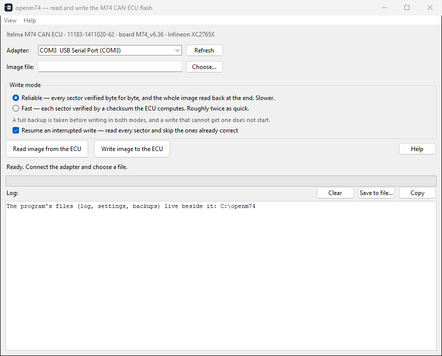
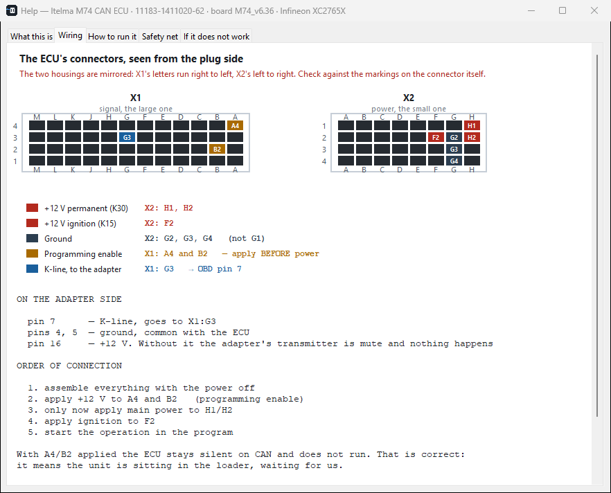
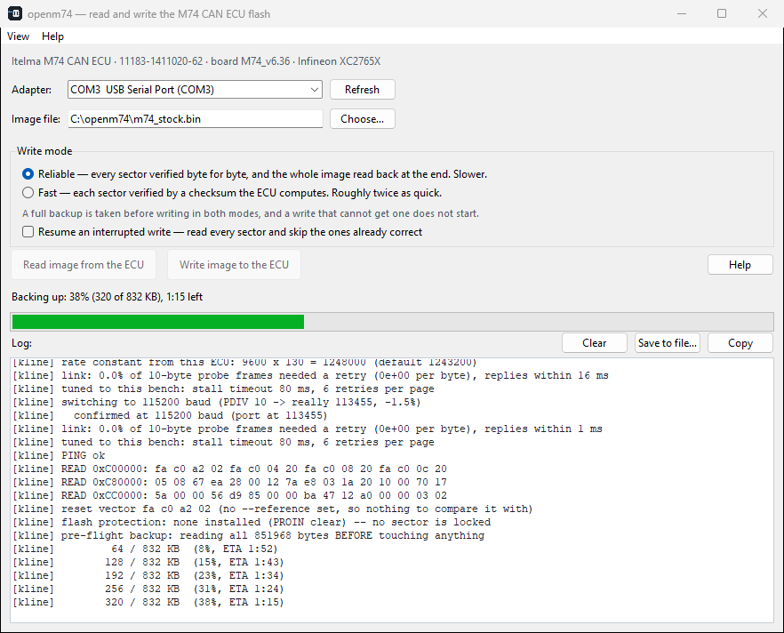
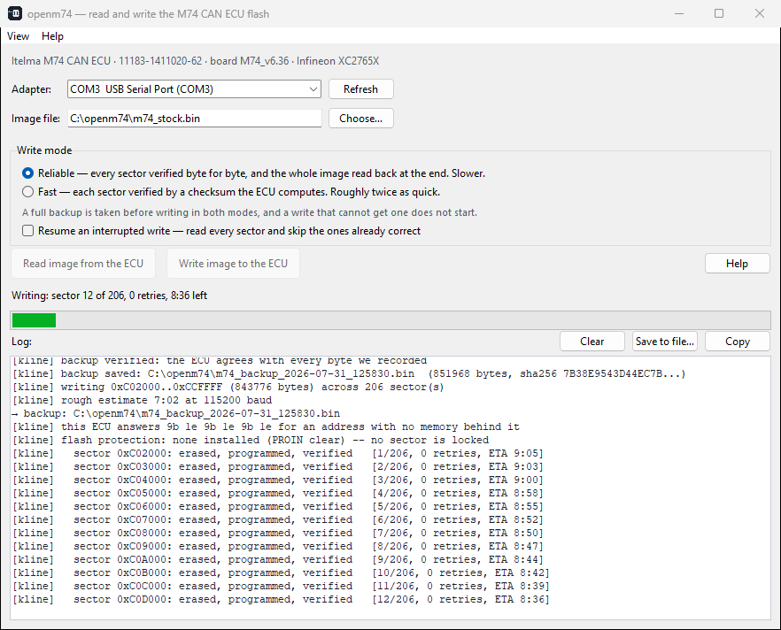

# openm74

Read and write the internal flash of an **Itelma M74 CAN** engine ECU (Infineon XC2765X)
over K-line, on the bench. Cross-platform, no vendor DLLs, no dongle, MIT licensed.

*[Русская версия — README.ru.md](README.ru.md)*



---

## What it does

* **Reads** the full 832 KB image in a single pass to a `.bin` file
* **Writes** a full `.bin` image back, verifying every sector as it goes
* Treats the image as opaque bytes — it does not parse, interpret or edit calibrations

Both directions have been proven byte-exact on hardware: an image written by this tool
and then read back by a *different* mechanism matched the source file 851968/851968.

## What it is not

* Not a calibration editor, not a tuning tool, not a diagnostic scanner
* Not for the external ST 95160 EEPROM — that is a separate chip and wants a clip-on
  programmer, not this connector
* Not for other ECU families as it stands — but "M74" covers at least six different
  microcontrollers, and this one targets the `SAK-XC2765X`. The non-CAN M74 uses the same
  part, and so do the Mikas 12 family and some Marelli units; M74K, M74M and everything from
  M74.8 onward do not, and neither does any Yanvar. A write is refused unless the silicon
  identifies itself as the part these stages were built for. Reading is never refused, and a
  dump from an unrecognised unit is exactly what would let it be supported —
  [docs/FINDINGS.md](docs/FINDINGS.md) §2b.

## Why it exists

**Over CAN, this ECU is not reachable without specialised commercial tooling.** The mask
ROM runs exactly one bootloader, chosen by the level on four pins latched at power-on, and
the pattern this ECU presents selects the *UART* one — so it listens on the K-line pin and
nowhere else. Reaching the CAN loader instead needs a different pattern held on those pins
at power-on and a host wired to CAN node 0's own pins, neither of which a vehicle-side cable
carries. That is the whole of it; see [docs/FINDINGS.md](docs/FINDINGS.md) §1. What is left is the *resident* loader in the
boot sector, which is proprietary and whose command table has erase, program and a CRC check
but **no read opcode at all**: a route that can write but cannot take a backup. For a device whose current contents may be the only copy in
existence, that is worse than no route. See [docs/FINDINGS.md](docs/FINDINGS.md) §1.

K-line is the alternative, and the microcontroller's own mask-ROM serial loader takes
arbitrary code and runs it — which is what makes reading possible at all, and what makes an
erased ECU recoverable rather than scrap.

What this project adds over the existing K-line tooling is **cross-platform**, **verified**
and **quick**: it runs on Windows, macOS and Linux from one code path; it reads a full
backup before erasing a byte and refuses to start without one; it verifies every sector and
says so when something did not land; and a whole 832 KB image goes in about eight minutes in fast mode, about thirteen in the reliable one that is the default.

## Safety

Flashing an ECU can leave it non-running. This tool is built around that fact:

* **A full backup is read before a single byte is erased**, and a write that cannot get
  that backup does not start. It is checked against the ECU's own checksum, not just
  received. (`--write-selftest`, which rewrites a single page or sector, saves that page or
  sector instead of all 832 KB — same rule, proportionate scope.)
* **Every sector is verified** after it is written; a mismatch stops the run rather than
  being discovered at the end
* **A write can be stopped, and resumed.** Closing the window during one asks the write to
  finish the sector it is on and stop there — behind it everything is verified, ahead of it
  nothing has been touched. `Ctrl-C` on the command line does the same. Re-run the same
  command with `--resume` and the sectors already correct are skipped.
  There is deliberately no way to stop *inside* a sector: an erase that has begun must be
  followed by its programming, or the old contents are gone and the new ones never arrived
* **The boot loader lives in mask ROM** and does not depend on flash contents, so an ECU
  whose flash is empty or half-written should still answer this same tool. Said as
  reasoning, not as a demonstration: recovery from a deliberately erased ECU has not been
  tested here, and it needs the same things a first write needs — the transceiver fitted,
  program-enable asserted, and a power cycle you can actually perform.

It will still refuse to claim success it has not earned: if part of the image could not
be placed, it says so instead of printing a green line.

## Hardware you need

* An M74 CAN ECU with the **L9637D K-line transceiver populated**. On the unit this was
  built against the footprint was empty and the part had to be fitted; there is evidence
  that other production runs ship with it already there, so **look at your own board
  first**. See [docs/HARDWARE.md](docs/HARDWARE.md), which covers the
  modification, the pull-up value that matters, and the pinout.
* Any K-line capable USB adapter (a K+DCAN cable works)
* A 12 V bench supply

The wiring is also in the program, so it is in front of you while you are wiring rather
than in a browser tab you have to keep finding — Help → Wiring:



## Quick start

Ready-made downloads are on the [Releases](../../releases) page, with the SHA256 of each
file next to it. They are not kept in the tree: a committed binary is ten megabytes added to
history on every rebuild, for a file that goes stale the moment the source moves — and a
stale binary beside fresh sources is worse than none, because whoever downloads it gets bugs
that were already fixed.

**Windows, no install at all:** download `openm74.exe` and run it. Nothing else is needed —
no Python, no runtime, no administrator rights.

**macOS, no install either:** download `openm74-macos-arm64.zip`, unzip, and run
`openm74.app`. Apple Silicon, macOS 11 or newer. The first launch needs **right-click →
Open**: the app is not notarised, so Gatekeeper's normal double-click path refuses it and
says the developer cannot be verified. That is expected, not a broken download — and it is
asked once, not every time. An Intel Mac needs its own build on an Intel Mac.

**From source** ([uv](https://docs.astral.sh/uv/), one command sets everything up):

```
uv sync
uv run openm74-gui                                          # graphical
uv run openm74 --port COM3 --oneshot --out dump.bin          # read
uv run openm74 --port COM3 --flash image.bin --yes           # write
uv run openm74 --port COM3 --flash image.bin --yes --resume  # continue an interrupted write
uv run openm74 --port COM3 --linktest                        # check the wiring
```

Plain pip works too: `pip install -e .`, then `openm74` and `openm74-gui`.

The application keeps its files **beside itself** — log, settings and pre-flight backups all
land in the folder the executable is in, so a copy of that folder is the whole installation
and there is one place to look. On macOS that means next to `openm74.app`, never inside the
bundle: writing in there would invalidate the signature and the app would stop launching.

It falls back to your home directory when that is impossible, and says which it did on the
first line of the log rather than leaving you to guess. Impossible happens for real reasons:
Program Files and /Applications are not writable, and a quarantined bundle opened from Finder
can be *app-translocated* — run from a randomised read-only copy that disappears afterwards,
taking anything written next to it with it. `OPENM74_DIR` overrides the choice.

The GUI is in English or Russian, chosen from the system language and switchable from the
**View menu** — the system menu bar on macOS, an in-window one elsewhere; the choice is remembered. Russian if the system says Russian, English for
everything else — a tool that silently speaks Russian to someone whose machine is set to
Portuguese is one they cannot use at all. `OPENM74_LANG=ru|en` overrides it.

The engine's log stays English on purpose. It is addresses, hex, register names, baud rates
and status bytes, and translating `ACK` or `baud` makes a log harder to search, harder to
compare against these documents and harder to paste into a bug report. What a person needs
to *understand* does not come from that stream anyway: it arrives as structured events
(`--progress json`) and the interface renders those in the chosen language.

The same menu switches the light or dark appearance, which otherwise follows the system.
`OPENM74_THEME=light` (or `dark`) forces one — useful for checking the palette you are not currently sitting in, since the
alternative is changing the whole machine's appearance and restarting, which is slow enough
that in practice nobody does it, and a palette nobody looks at is how a window full of
invisible text ships.

To compare a read against a dump you took earlier, pass `--reference dump.bin` (or set
`OPENM74_REFERENCE`). None is shipped: a dump is one vehicle's data.

Bringing up a new bench and nothing works? `--linktest` measures both directions
separately and says which one is bad and what that implicates. There are lower-level
probes too — see [docs/HARDWARE.md](docs/HARDWARE.md).

Every operation begins by asking you to power-cycle the ECU. That is not a quirk of this
tool: the ROM loader only arms on a true power-on reset and measures the line speed from
the very first byte, once. See [docs/PROTOCOL.md](docs/PROTOCOL.md).

**And it cannot be done in software — measured, not assumed.** A stub that stops feeding the
watchdog does reset the MCU (it streamed for 0.21 s and went quiet), but twelve handshakes
over the next 3.6 s got back nothing: after a watchdog reset control goes to the resident CAN
loader, which does not speak K-line. If you want the prompt gone, the supply itself has to be
switched — `--power-line dtr|rts` drives a relay or high-side switch on the +12 V feed
through the adapter's handshake pin and cycles the ECU for you. That path is opt-in and has
not been exercised on hardware here, because this bench has no such switch.

## Two modes

| | `reliable` (default) | `fast` |
|---|---|---|
| Per-sector verify | byte-exact read-back | checksum computed by the ECU |
| Full image read-back at the end | yes | no |
| Blank check after each erase | full sector | first page |
| Whole image, backup included | **~13 minutes** | **~8 minutes** |

Both run at the same line rate, chosen by measurement. The modes differ in exactly one
thing: how hard a written sector is checked afterwards.

### How fast, and what actually limits it

Measured end to end on two different hosts, an M74 CAN ECU and a K+DCAN cable, at the
115200 the tool now settles on:

| | |
|---|---|
| Reading the whole 832 KB | **about 2 minutes** (~6900 B/s sustained) |
| Sector erase | 0.02 s |
| Programming a sector's 32 pages | 1.44 s |
| Verifying a sector by checksum | 0.02 s |
| Verifying a sector by reading it back | 0.59 s |

Per rate, each one exercised the way it is used — a sustained read *and* real page
programming, not a ping:

| Rate | Sustained read | Pages resent |
|---|---|---|
| 38400 | 2415 B/s | 0 |
| 57600 | 3604 B/s | 0 |
| 76800 | 4720 B/s | 0 |
| **115200** | **6973 B/s** | **0** |
| 153600 | the ECU stops answering at any rate afterwards | — |

**What dominates is programming, not erase, and not the wire.** That is worth saying
plainly because this project spent a long time believing the opposite: an earlier version
of these documents put the erase at five seconds and told you a whole image could not go
below seventeen minutes. Both came from runs where the host's own serial driver was
corrupting the link, so every erase overran its timeout and was clocked as recovery. See
[docs/QUIRKS.md](docs/QUIRKS.md) §1.


A pre-flight backup is taken in both. Speed is chosen by measurement, not by the user:
the tool probes the link, picks the fastest rate that sustains *the job it is about to
do*, and steps down if that turns out to be optimistic.

A write therefore begins by reading — the whole image comes out before anything is erased:



and then goes in a sector at a time, each one erased, programmed and read back before the
next is touched. The counter shows retries as they happen rather than hiding them: on this
link a corrupted frame is normal, and it is resent, which is why the number climbs while
nothing is wrong.



## Other ECUs you may be able to try

**Untested, entirely at your own risk, and read the sentence after the table before you act
on it.**

The tool targets the Infineon `SAK-XC2765X`. That is a *die*, not a part number: several
marketing names share it, and they share the memory map and register layout with it, which
is what actually decides whether the code this tool uploads is safe to run.

| ECU | Microcontroller | Same map? | How strong is the evidence |
|---|---|---|---|
| **M74** (non-CAN, K-line) | SAK-XC2765X | **yes** | firmware packs and tool lists name the same part |
| **M74 CAN** | SAK-XC2765X | **yes** | this is the reference unit — measured |
| **Mikas 12 / 12.3 / 12.48** | SAK-XC2765X | **yes** | repair documentation |
| **Marelli IAW 7GV** | SAK-XC2785X | **yes** — same die | tool compatibility lists |
| **Marelli IAW MIU4** (Vespa, Moto Guzzi, Aprilia) | XC2765 | **yes** — same die | vendor markets it by that name |
| M74K | ST10F273 | no | different core entirely |
| M74M | XC2361A or XC2060M | XC2361A shares the die; XC2060M unknown | no public datasheet for XC2060M |
| M74.8 and later, M74.9 | SPC58, then ARM | no | different architecture |
| Yanvar 5.1 / 7.2 | SAF-C509 (8-bit) | no | — |
| Yanvar 7.2+ / M73 | ST10F273 | no | — |

**The tool checks this for you, and you should let it.** Before writing it asks the silicon
what it is and where its memory answers from, and refuses if either disagrees. That check is
not about picking the wrong file — it is there because this family contains parts that
answer the same handshake, honestly report the same 832 KB, and put their flash somewhere
else. `--force-unknown-ecu` on the command line, or the **Advanced** menu in the interface,
turns it off; both say what they are overriding.

**Reading is never blocked.** If you have one of the rows above, or something else entirely,
a dump does not erase or program anything — and a dump plus the output of
`tools/probe_identity.py` is exactly what would turn a "maybe" in that table into something
this project can actually support. Reports are welcome.

Two warnings that are not boilerplate. The wiring differs between these ECUs even where the
silicon does not — programming-enable and K-line land on different connector pins, and
[docs/HARDWARE.md](docs/HARDWARE.md) describes only the M74 CAN. And a successful handshake
proves nothing: `0xD5` is answered by every modern C166-family part including ST10, which
loads code to a completely different address.

## Status and limitations

Be clear-eyed about what has and has not been demonstrated.

**Proven on hardware:** full read (repeatable to an identical SHA256 across sessions, line
speeds, and both host operating systems — the same ECU has been driven from macOS and from a
separate Windows PC), full write of a *different* image with every sector verified, and the
original written back and read out matching byte for byte — 851968/851968. Both write modes
have now been run start to finish, and `fast` — whose per-sector check is a checksum the ECU
computes — was confirmed afterwards by a full read on a later session that matched the
source image 851968/851968.

**The link adapts itself, and on a bench like this one it has to.** Measured here, the same
cable and connector delivered a clean 19200 in one session and could not carry a backup at
57600 twenty minutes later. So the tool starts at the mode's rate, watches its own transfers
— real pages, real answers, not a synthetic probe — and drops a rung when what it observes
says the run is at risk or that the rung below would deliver more. It never climbs back, and
it never slows down merely because the log looks busy. On a bench that does not need any of
this, none of it fires.

**Limitations you should know about:**

* **One ECU.** Everything here was developed and verified on a single unit. Other board
  revisions and part numbers are untested. If yours behaves differently, the diagnostics
  in [docs/HARDWARE.md](docs/HARDWARE.md) are the place to start, and a report is welcome.
* **Linux has been built and looked at, but not yet driven against an ECU.** Both test
  suites, every platform check, a PyInstaller bundle and the interface itself were run on
  Ubuntu 22.04 (arm64, in a container) and the window was screenshotted in both palettes
  and both languages. What that does *not* cover is the serial layer against real hardware:
  the port naming, the `dialout` group, and the mid-session baud change. The development
  bench is a Mac, and a container on a Mac cannot be given the USB adapter.
* `--oneshot` (the streaming reader) does not use the mid-session speed change, so it
  runs at the handshake rate. Reading through the monitor is faster.
* `reliable` mode has now been run end to end on hardware: a full 832 KB image written with
  205 of its 206 sectors verified byte for byte — the 206th is `0xC0F000`, which has no
  memory behind it on this part and is named and skipped — zero retries across the run, followed by
  a full read-back. The image was then read out again by the *streaming* reader — a
  different mechanism from the monitor that wrote it — and matched.
* Writing is limited by page programming, which scales with the line rate — a sector erase
  is 20 ms and is not the bottleneck. A whole image runs about 8 minutes in fast mode and
  13 in reliable, backup included.

## Disclaimer

This project exists for **research, education, repair and recovery**. It was built to
understand a microcontroller's documented bootloader and to make backing up and restoring
an ECU's flash something you can do yourself, verifiably, without a dongle.

**What it is not, deliberately:**

* It does not bypass, defeat or circumvent any protection mechanism. It uses the MCU
  manufacturer's own serial loader, which is a documented feature of the part and is not
  key-protected, password-protected or encrypted. Nothing here defeats a security measure
  because there is no security measure in the path. This part *does* have a flash
  protection facility, and the tool's relationship with it is to **read it and report it**:
  it checks the protection registers before writing and stops at any sector protection
  refuses. Disabling that protection needs a 64-bit password command sequence, which this
  tool does not implement and will not.
* It contains no third-party code. The stages and the host were written from the
  manufacturer's documentation and from measurements taken on hardware.
* It does not read, modify or interpret the *content* of a firmware image. It moves bytes
  in and out. It is not a calibration editor and has no notion of what any byte means.
* **It never touches the network.** No telemetry, no update check, no phoning home — there
  is no code in it that opens a socket. It works on a bench with no internet at all, and
  that claim is checkable by reading one file with one dependency rather than taken on
  trust. For a tool you are asked to point at someone else's ECU, that should be stated
  rather than assumed.

**Your responsibility.** Flashing an ECU can leave a vehicle inoperable, and modifying
engine control software may be restricted where you live — emissions and roadworthiness
rules are the usual ones, and they vary by country. Use this on hardware you own or are
authorised to work on, and make sure what you do with it is lawful where you are. That
judgement is yours, not this project's.

**No warranty.** The MIT licence says this in legal language; in plain language: this
software is provided as-is, and the authors are not liable if something goes wrong. Take
the backup. The tool refuses to write without one for a reason.

## Documentation

* [docs/HARDWARE.md](docs/HARDWARE.md) — the ECU modification, pinout, bench wiring
* [docs/PROTOCOL.md](docs/PROTOCOL.md) — bootloader entry, stages, the monitor's command
  set, flash command sequences
* [docs/QUIRKS.md](docs/QUIRKS.md) — everything the K-line does that no datasheet mentions
* [docs/FINDINGS.md](docs/FINDINGS.md) — the error model, dead ends, and the measurement
  mistakes that produced them
* [docs/DEVELOPING.md](docs/DEVELOPING.md) — the JSON interface, building, running the checks

**If you are building anything that talks to hardware over a serial port, read
[QUIRKS.md](docs/QUIRKS.md) §1 even if you never touch an ECU.** The largest apparent
physical-layer effects on this link — a corrupted byte at every turnaround, failure rates
that tracked the shape of the data, an erase that seemed to take five seconds — were the
host reprogramming its own serial port mid-transfer. Every one of them was reproducible and
had a coherent bit-level explanation, and every one of them was wrong.

