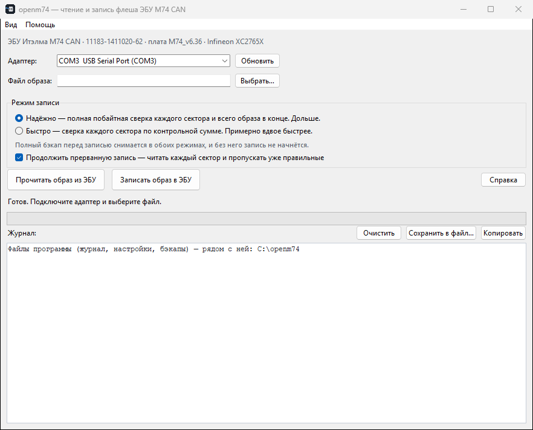
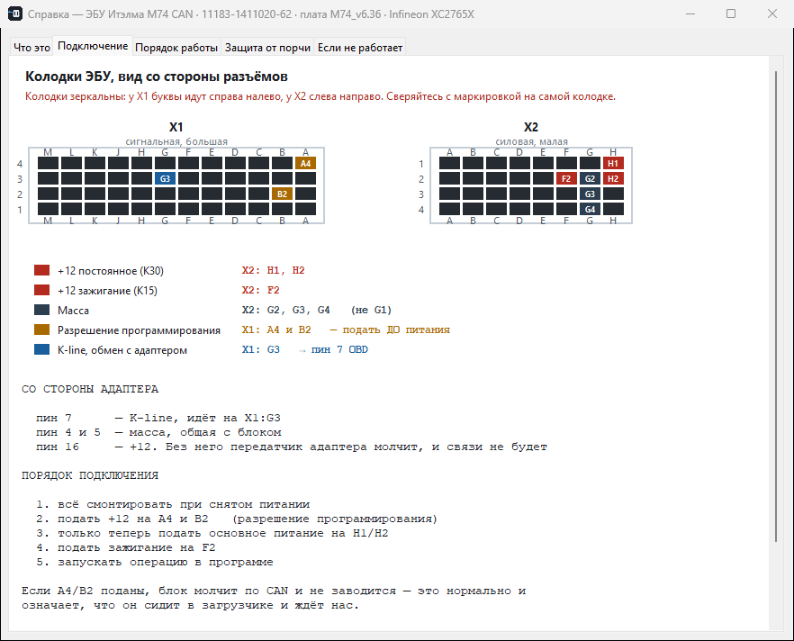
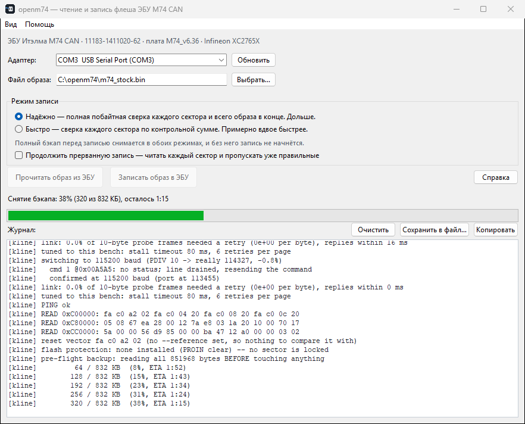
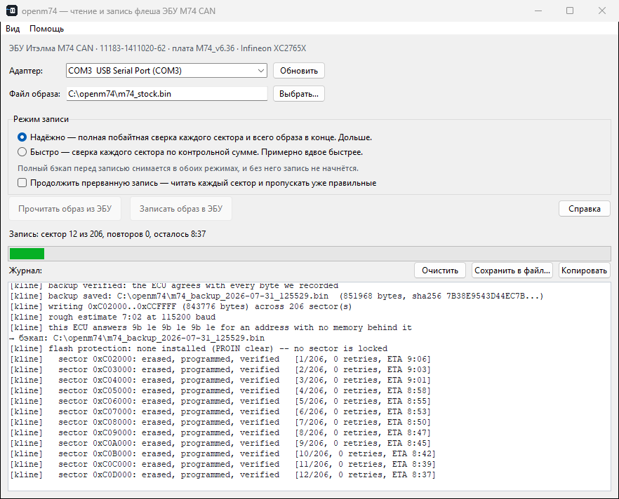

# openm74

*[English version — README.md](README.md)*

Чтение и запись внутренней флеш-памяти ЭБУ **Итэлма M74 CAN** (Infineon XC2765X) по
K-line, на столе. Кроссплатформенно, без вендорских DLL и ключей, лицензия MIT.



## Что умеет

* **Читать** весь образ 832 КБ за один проход в файл `.bin`
* **Записывать** образ обратно со сверкой каждого сектора
* Работает с образом как с набором байт — не разбирает и не правит калибровки

Обе стороны доказаны на железе побайтно: записанный образ, прочитанный обратно **другим
механизмом**, совпал с исходным файлом 851968/851968.

## Чем не является

* Не редактор калибровок, не тюнинг, не диагностический сканер
* Не работает с внешней EEPROM 95160 — это отдельная микросхема под программатор
* В нынешнем виде — не для других семейств ЭБУ. Но «M74» — это как минимум шесть разных
  микроконтроллеров, а здесь целевой `SAK-XC2765X`. У обычного M74 без CAN тот же кристалл,
  как и у семейства Микас 12 и части блоков Marelli; у M74K, M74M и всего от M74.8 и дальше —
  другие, и ни один Январь сюда не относится. Запись отклоняется, если кристалл не опознал
  себя как тот, под который собраны стейджи. Чтение не отклоняется никогда, и дамп с
  неопознанного блока — ровно то, из чего могла бы вырасти поддержка:
  [docs/FINDINGS.ru.md](docs/FINDINGS.ru.md) §2b.

## Почему он существует

**По CAN этот блок недостижим ничем, кроме специализированных коммерческих решений.** ПЗУ
запускает ровно один загрузчик, и какой именно — решает уровень на четырёх выводах,
защёлкнутый в момент включения питания. Рисунок, который выставляет этот блок, выбирает
загрузчик **по UART**, поэтому он слушает вывод K-линии и больше ничего. Чтобы попасть в
CAN-загрузчик, нужен другой рисунок на тех же выводах при включении и хост, подключённый к
собственным выводам узла CAN 0, — ни того, ни другого автомобильный разъём не несёт. Этим всё
и объясняется, подробности в [docs/FINDINGS.ru.md](docs/FINDINGS.ru.md) §1. Остаётся **резидентный** загрузчик в бут-секторе — проприетарный, и в его таблице
команд есть стирание, запись и проверка CRC, но **нет команды чтения вообще**: путь, которым
можно записать, но нельзя снять копию. Для блока, где текущее содержимое может оказаться
единственным экземпляром, это хуже, чем отсутствие пути. См. [docs/FINDINGS.ru.md](docs/FINDINGS.ru.md) §1.

K-line — альтернатива, и собственный последовательный загрузчик микроконтроллера, зашитый в
маску ПЗУ, принимает произвольный код и запускает его. Именно это делает чтение возможным
вообще, а стёртый блок — восстановимым, а не выброшенным.

Что этот проект добавляет к существующим средствам работы по K-line: он **кроссплатформенный**
(Windows, macOS и Linux из одного кода), **сверяющий** (полный бэкап снимается до того, как
стёрт первый байт, и без него запись не начнётся; каждый сектор проверяется, и о несовпадении
говорится вслух) и **быстрый** — полный образ 832 КБ уходит меньше чем за восемь минут.

## Безопасность

Прошивка ЭБУ может оставить блок незапускающимся. Инструмент построен вокруг этого:

* **Полный бэкап снимается до первой стёртой ячейки**, и без него запись не начнётся. Он
  ещё и сверяется с контрольной суммой, посчитанной самим ЭБУ, а не просто принимается.
  (`--write-selftest` переписывает одну страницу или сектор и сохраняет именно их, а не все
  832 КБ, — то же правило в соразмерном объёме.)
* **Каждый сектор проверяется** сразу после записи, а не в конце
* **Запись можно остановить, а потом продолжить.** Закрытие окна во время записи просит её
  дописать текущий сектор и остановиться на нём: позади всё сверено, впереди ничего не
  тронуто. `Ctrl-C` в терминале делает то же самое. Повторный запуск с `--resume` пропустит
  уже правильные секторы.
  Останавливаться *внутри* сектора сознательно нельзя: начатое стирание обязано быть
  дополнено программированием, иначе старого содержимого уже нет, а нового ещё нет
* **Загрузчик лежит в ПЗУ** и не зависит от содержимого флеша, поэтому блок с пустым или
  наполовину записанным флешем должен отвечать этой же программе. Это рассуждение, а не
  показанный опыт: восстановление намеренно стёртого блока здесь не проверялось, и ему нужно
  то же самое, что и первой записи, — впаянный трансивер, поданный program-enable и
  возможность передёрнуть питание

И он не станет объявлять успех, которого не было: если часть образа лечь не смогла, он
скажет об этом прямо.

## Что нужно из железа

* ЭБУ M74 CAN с **впаянным трансивером L9637D**. На блоке, на котором всё это делалось,
  площадка была пустая и микросхему пришлось ставить; есть свидетельства, что часть партий
  уходит с завода уже с ней, так что **сначала посмотрите на свою плату**. Подробно в
  [docs/HARDWARE.ru.md](docs/HARDWARE.ru.md): доработка, какой номинал подтяжки решает, распиновка.
* Любой USB-адаптер с K-line (подходит K+DCAN)
* Блок питания 12 В

Схема подключения есть и в самой программе — она перед глазами, пока вы паяете, а не во
вкладке браузера, которую надо каждый раз искать. «Помощь» → «Подключение»:



## Быстрый старт

Готовые сборки — на странице [Releases](../../releases), рядом с каждой лежит её SHA256.

```
# Windows: скачать openm74.exe и запустить — больше ничего не нужно
# macOS:   скачать openm74-macos-arm64.zip, распаковать, запустить openm74.app.
#          Apple Silicon, macOS 11+. ПЕРВЫЙ запуск — правой кнопкой → «Открыть»:
#          приложение не нотаризовано, и обычный двойной клик Gatekeeper отклонит.
#          Это не признак испорченного файла и спрашивается один раз.
#          Для Intel Mac нужна отдельная сборка, собранная на Intel Mac.

uv sync
uv run openm74-gui                                           # интерфейс
uv run openm74 --port COM3 --oneshot --out dump.bin           # чтение
uv run openm74 --port COM3 --flash image.bin --yes            # запись
uv run openm74 --port COM3 --flash image.bin --yes --resume   # продолжить прерванную запись
uv run openm74 --port COM3 --linktest                         # проверка стенда
```

Обычный `pip` тоже работает: `pip install -e .`, дальше `openm74` и `openm74-gui`.

Программа держит свои файлы **рядом с собой** — журнал, настройки и предзаписные бэкапы
ложатся в ту же папку, где лежит исполняемый файл. Скопировали папку — скопировали всю
установку, и искать нужно в одном месте. На macOS это папка рядом с `openm74.app`, а не
внутри бандла: запись внутрь сломала бы подпись и приложение перестало бы запускаться.

Если это невозможно, программа уходит в домашний каталог и сообщает об этом первой строкой
журнала, а не оставляет гадать. Невозможно бывает по вполне реальным причинам: `Program
Files` и `/Applications` не доступны на запись, а бандл с карантином, открытый из Finder,
может попасть под *app translocation* — запуск из случайной копии только для чтения, которая
потом исчезает вместе со всем, что рядом с ней записали. Переопределяется через `OPENM74_DIR`.

Ещё три переменные окружения: `OPENM74_LANG=ru|en` задаёт язык интерфейса помимо системного,
`OPENM74_THEME=light|dark` принудительно включает тему, а `OPENM74_REFERENCE` указывает на
эталонный дамп для `--reference`. Готового дампа в комплекте нет: дамп — это данные
конкретной машины.

Каждая операция начинается с просьбы передёрнуть питание. Это не недоработка: заводской
загрузчик запускается только при настоящем сбросе по питанию и подстраивается под
скорость по первому байту — ровно один раз за сброс.

## Два режима

| | `reliable` (по умолчанию) | `fast` |
|---|---|---|
| Сверка сектора | побайтным чтением | контрольной суммой от ЭБУ |
| Полная сверка образа в конце | да | нет |
| Проверка стирания | весь сектор | первая страница |
| Полный образ вместе с бэкапом | **~13 минут** | **~8 минут** |

Оба режима едут на одной скорости, и она подбирается замером. Отличаются они ровно одним:
насколько строго проверяется записанный сектор.

### Насколько быстро и чем это ограничено

Замерено от начала до конца на двух разных хостах, на ЭБУ M74 CAN и кабеле K+DCAN, на тех
115200, которые инструмент теперь выбирает сам:

| | |
|---|---|
| Чтение всех 832 КБ | **около 2 минут** (~6900 Б/с) |
| Стирание сектора | 0.02 с |
| Программирование 32 страниц сектора | 1.44 с |
| Сверка сектора контрольной суммой | 0.02 с |
| Сверка сектора вычитыванием | 0.59 с |

По скоростям, и каждая проверена так, как используется, — длительным чтением **и** настоящим
программированием страниц, а не пингом:

| Скорость | Чтение | Повторов страниц |
|---|---|---|
| 38400 | 2415 Б/с | 0 |
| 57600 | 3604 Б/с | 0 |
| 76800 | 4720 Б/с | 0 |
| **115200** | **6973 Б/с** | **0** |
| 153600 | ЭБУ перестаёт отвечать на любой скорости | — |

**Определяет время программирование, а не стирание и не провод.** Стоит сказать прямо,
потому что этот проект долго считал наоборот: прежняя версия этих документов отводила
стиранию пять секунд и обещала, что полный образ не уложится быстрее семнадцати минут. Обе
цифры получены на прогонах, где линию портил собственный последовательный драйвер хоста, так
что каждое стирание выходило за таймаут и засчитывалось как восстановление. См.
[docs/QUIRKS.ru.md](docs/QUIRKS.ru.md) §1.

Бэкап снимается в обоих. Скорость выбирается **замером, а не пользователем**, и решает не
разовая проба перед стартом, а сама работа: тул смотрит на собственные посылки — настоящие
страницы и настоящие ответы — и спускается на ступень ниже, когда видит, что прогон под
угрозой или что нижняя ступень отдала бы больше. Обратно вверх не поднимается. На стенде,
которому всё это не нужно, ничего из этого не срабатывает.

Так и должно быть: на этом стенде один и тот же кабель в одной сессии держал чистые 19200,
а через двадцать минут не смог дотащить бэкап на 57600.

Поэтому запись начинается с чтения — весь образ снимается до того, как что-то будет стёрто:



а дальше идёт по одному сектору: стирание, программирование, чтение обратно — и только
потом следующий. Счётчик повторов показывается, а не прячется: на этой линии испорченный
кадр — норма, он переспрашивается, и растущее число не означает, что что-то не так.



## Другие блоки, которые можно попробовать

**Не проверено, целиком на ваш страх и риск, и обязательно прочтите абзац после таблицы.**

Инструмент рассчитан на Infineon `SAK-XC2765X`. Это *кристалл*, а не номер детали: под ним
продаётся несколько имён, и все они делят с ним карту памяти и раскладку регистров — а
именно это и решает, безопасно ли выполнять код, который инструмент заливает в блок.

| ЭБУ | Микроконтроллер | Та же карта? | Насколько твёрдо |
|---|---|---|---|
| **M74** (без CAN, по K-линии) | SAK-XC2765X | **да** | подборки прошивок и списки совместимости называют ту же деталь |
| **M74 CAN** | SAK-XC2765X | **да** | это эталонный блок — измерено |
| **Микас 12 / 12.3 / 12.48** | SAK-XC2765X | **да** | ремонтная документация |
| **Marelli IAW 7GV** | SAK-XC2785X | **да** — тот же кристалл | списки совместимости |
| **Marelli IAW MIU4** (Vespa, Moto Guzzi, Aprilia) | XC2765 | **да** — тот же кристалл | вендор так его и называет |
| M74K | ST10F273 | нет | совсем другое ядро |
| M74M | XC2361A или XC2060M | у XC2361A тот же кристалл, про XC2060M неизвестно | на XC2060M нет открытого даташита |
| M74.8 и новее, M74.9 | SPC58, затем ARM | нет | другая архитектура |
| Январь 5.1 / 7.2 | SAF-C509 (8-битный) | нет | — |
| Январь 7.2+ / М73 | ST10F273 | нет | — |

**Инструмент проверяет это за вас, и лучше ему не мешать.** Перед записью он спрашивает у
кристалла, что он такое и откуда у него отвечает память, и отказывается, если что-то не
сходится. Проверка не про «выбрали не тот файл». Она про то, что в этом семействе есть
детали, которые отвечают на то же рукопожатие, честно сообщают те же 832 КБ и держат флеш в
другом месте. Отключается флагом `--force-unknown-ecu` в командной строке или пунктом меню
**«Дополнительно»** в интерфейсе; оба говорят, что именно отключают.

**Чтение не блокируется никогда.** Если у вас блок из таблицы выше — или вообще другой, —
снятие дампа ничего не стирает и не программирует. А дамп вместе с выводом `tools/probe_identity.py`
— ровно то, из чего «может быть» в этой таблице превращается в настоящую поддержку. Присылайте.

Два предупреждения, и это не формальность. Распиновка у этих блоков разная даже там, где
кристалл общий: разрешение программирования и K-линия выходят на разные контакты колодки, а
[docs/HARDWARE.ru.md](docs/HARDWARE.ru.md) описывает только M74 CAN. И успешное рукопожатие не
доказывает ничего: `0xD5` отвечает любая современная деталь семейства C166, включая ST10,
который грузит код совсем по другому адресу.

## Статус и ограничения

Стоит понимать, что доказано, а что нет.

**Доказано на железе:** полное чтение (повторяется до одинакового SHA256 в разных сессиях,
на разных скоростях и с обеих операционных систем — один и тот же ЭБУ водили с macOS и с
отдельного компьютера на Windows), полная запись *другого* образа со сверкой
каждого сектора, и запись оригинала обратно с последующим вычитыванием — совпало байт в
байт, 851968/851968. Оба режима записи пройдены целиком, причём `fast` — тот, где сектор
проверяется суммой, посчитанной самим ЭБУ, — подтверждён потом полным чтением в другой
сессии: 851968/851968 с исходным образом.

**Связь подстраивается сама, и на таком стенде, как наш, иначе нельзя.** Замерено здесь же:
один и тот же кабель держал чистые 19200, а через двадцать минут не смог дотащить бэкап на
57600. Поэтому решение принимает не разовая проба, а сама работа — по своим же посылкам.

* **Один экземпляр ЭБУ.** Всё разработано и проверено на одном блоке. Другие ревизии плат
  и номера деталей не проверялись. Если ваш ведёт себя иначе — начните с диагностик в
  [docs/HARDWARE.ru.md](docs/HARDWARE.ru.md), и сообщите о результате.
* `--oneshot` (потоковое чтение) не умеет менять скорость по ходу сессии и работает на
  скорости рукопожатия. Через монитор читать быстрее.
* Режим `reliable` пройден на железе целиком: образ 832 КБ записан, 205 секторов из 206
  сверены побайтно — 206-й это `0xC0F000`, за которым на этом кристалле нет памяти, он
  назван и пропущен, — ноль повторов за прогон, затем полная сверка чтением. После этого образ
  снят *потоковым* чтением — другим механизмом, не тем, что писал, — и совпал.
* Время записи определяет программирование страниц, а оно зависит от скорости связи:
  стирание сектора занимает 20 мс и узким местом не является. Полный образ вместе с бэкапом
  идёт около 8 минут в режиме `fast` и около 13 в `reliable`.
* **Linux собран и осмотрен, но на живом ЭБУ ещё не гонялся.** Оба набора тестов, все
  платформенные проверки, сборка PyInstaller и сам интерфейс прогнаны на Ubuntu 22.04
  (arm64, в контейнере), окно снято в обеих темах и на обоих языках. Чего это не покрывает —
  работу с портом на реальном железе: именование устройства, группу `dialout` и смену
  скорости по ходу сессии. Стенд разработки — Mac, а контейнеру на Mac USB-адаптер не
  отдать.

## Отказ от ответственности

Проект существует для **исследования, обучения, ремонта и восстановления**. Он сделан, чтобы
разобраться в документированном загрузчике микроконтроллера и дать возможность самому,
проверяемо и без донглов, снять и вернуть содержимое флеша ЭБУ.

**Чем он сознательно не является:**

* Он не обходит, не отключает и не преодолевает никаких защитных механизмов. Он использует
  штатный последовательный загрузчик производителя МК — документированную функцию кристалла,
  не защищённую ни ключом, ни паролем, ни шифрованием. Здесь нечего обходить, потому что на
  этом пути нет защиты. При этом у кристалла **есть** механизм защиты флеша от записи, и
  отношение программы к нему одно: **прочитать и доложить**. Перед записью читаются регистры
  защиты и докладывает, что нашёл, а прогон останавливается на секторе, который контроллер
  действительно отказался стирать. Снятие такой защиты
  требует 64-битной парольной последовательности, которая здесь не реализована и реализована
  не будет.
* В нём нет чужого кода. Стейджи и хост написаны по документации производителя и по
  измерениям на железе.
* Он не читает, не изменяет и не интерпретирует *содержимое* прошивки. Он перемещает байты.
  Это не редактор калибровок, и он не знает, что значит любой из этих байтов.
* Он не выходит в сеть. Ни телеметрии, ни проверки обновлений, ни единого сетевого
  обращения — ни одной строчки, которая бы их делала. Всё работает на столе без интернета,
  и это проверяется чтением единственного файла с зависимостью на pyserial.

**Ваша ответственность.** Прошивка ЭБУ может оставить машину неработоспособной, а изменение
программы управления двигателем может быть ограничено законом там, где вы живёте — обычно
это нормы по выбросам и допуску к эксплуатации, и они разнятся по странам. Используйте это
на технике, которой владеете или на работу с которой уполномочены, и убедитесь, что то, что
вы делаете, законно в вашей юрисдикции. Это ваше решение, а не проекта.

**Без гарантий.** Лицензия MIT говорит это юридическим языком; простым: программа поставляется
как есть, и авторы не отвечают, если что-то пойдёт не так. Снимайте бэкап. Программа не зря
отказывается писать без него.

## Документация

* [docs/HARDWARE.ru.md](docs/HARDWARE.ru.md) — доработка блока, распиновка, сборка стенда
* [docs/PROTOCOL.ru.md](docs/PROTOCOL.ru.md) — вход в загрузчик, стейджи, команды монитора и флеша
* [docs/QUIRKS.ru.md](docs/QUIRKS.ru.md) — всё, что K-line делает вопреки даташитам
* [docs/FINDINGS.ru.md](docs/FINDINGS.ru.md) — модель ошибок, тупики и ошибки измерений
* [docs/DEVELOPING.ru.md](docs/DEVELOPING.ru.md) — JSON-интерфейс, сборка, прогон проверок

Документация в `docs/` — на английском. Интерфейс программы, встроенная справка и подсказки
об ошибках переведены полностью; две копии измеренных утверждений расходятся, и разошедшаяся
начинает врать, поэтому исследовательские заметки живут в одном экземпляре.

**Если вы делаете что угодно, работающее с железом через последовательный порт, прочтите
[QUIRKS.md](docs/QUIRKS.md) §1, даже если ЭБУ вас не касается.** Самые крупные «эффекты
физического уровня» на этой линии — испорченный байт на каждом развороте, зависимость потерь
от рисунка данных, пятисекундное стирание — оказались тем, что хост переконфигурировал
собственный последовательный порт посреди передачи. Каждый воспроизводился, каждый имел
связное побитовое объяснение, и каждый был неверен.
