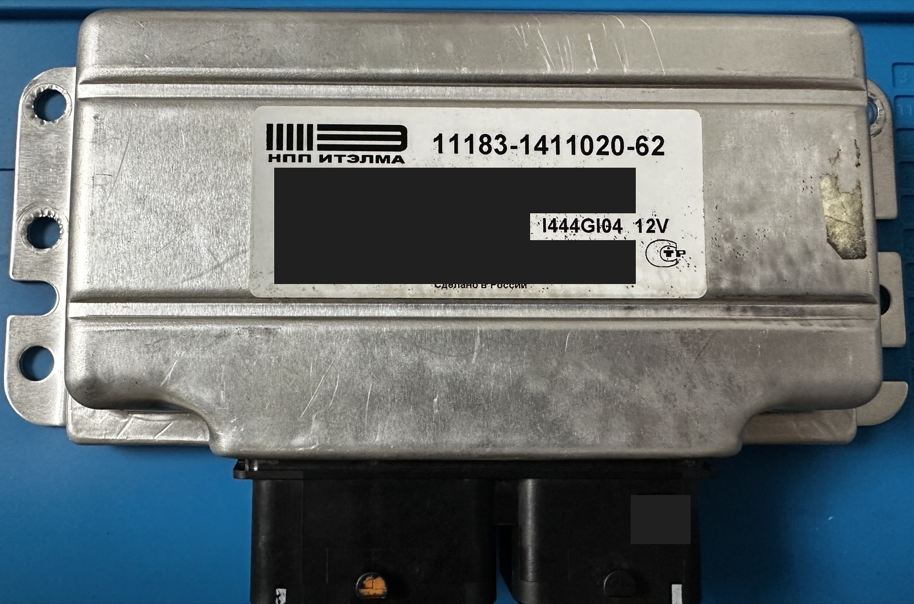
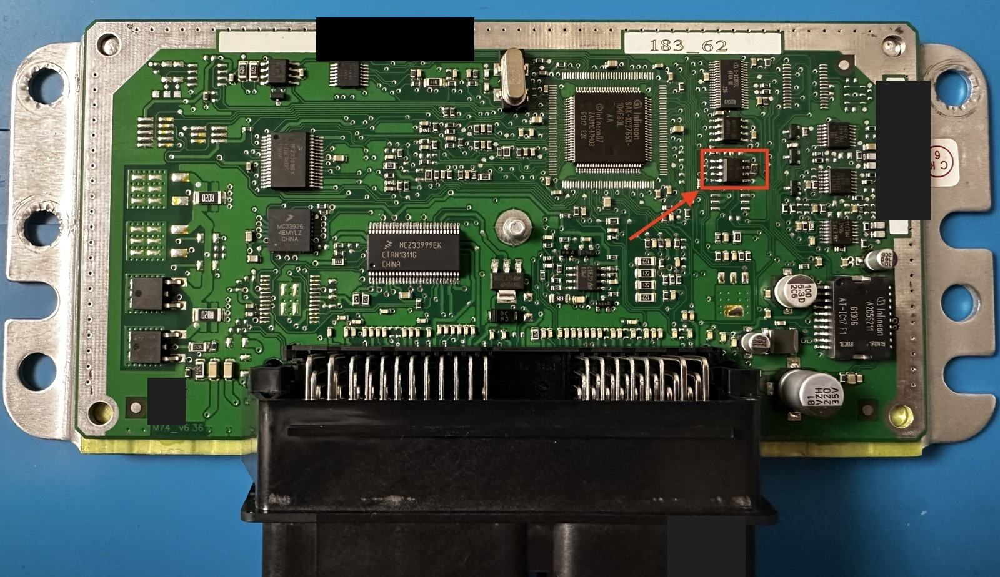
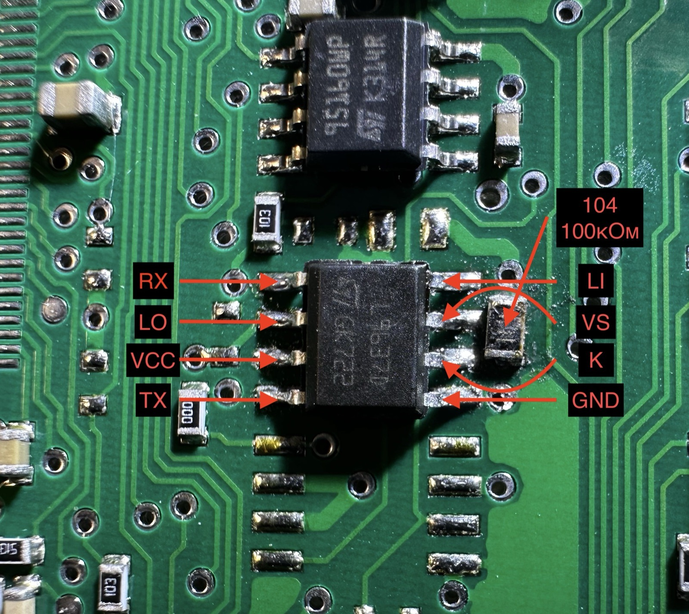

# Как заставить M74 CAN заговорить: железная часть

*[English version — HARDWARE.md](HARDWARE.md). Английская версия — источник истины: если
числа здесь и там разойдутся, верить надо ей, а расхождение — чинить.*

Всё, что здесь написано, установлено на столе, на живом блоке. Тупики записаны тоже — как
совет, чего не делать: это недели, которые кому-то не придётся тратить.



Экземпляр, на котором всё делалось: **Итэлма M74 CAN, номер детали 11183-1411020-62,
шелкография платы M74_v6.36**, микроконтроллер **Infineon SAK-XC2765X-104F80L** (ядро
C166SV2, 832 КБ внутреннего флеша, кварц 8 МГц). Отдельной микросхемы флеша нет: и
программа, и калибровки лежат внутри микроконтроллера, поэтому единственный путь внутрь —
его собственный загрузчик.

---

## 1. Коротко

1. Впаять **L9637D** (SO-8) в пустое посадочное место.
2. В соседнее посадочное место резистора поставить **100 кОм (маркировка `104`)** — *не*
   510 Ом. Это единственное значение решает, будет блок работать или не заведётся вовсе.
   См. §3.
3. K-line выходит на **X1:G3**. Соединить с контактом 7 колодки OBD адаптера.
4. Подать питание на блок, program-enable подать **до** питания, запустить программу.

Это вся доработка. Больше ничего не добавляется и ничего не режется.

---

## 2. Почему доработка вообще нужна — на этом экземпляре

**Посмотрите свою плату, прежде чем верить этому разделу.** На экземпляре M74_v6.36, под
который делался проект, CAN-трансивер распаян, а **посадочное место L9637D пустое**, так что
из коробки блок говорит по CAN и больше никак. Это одна плата. Есть косвенные свидетельства
— видео, где блоки M74 CAN читают и пишут по K-line вообще без доработки, — что другие
производственные партии уходят с завода уже с ним, а вокруг посадочного места есть ещё
несколько нераспаянных площадок, что как раз и выглядит как плата, общая для нескольких
вариантов.

Поэтому честная формулировка такая: **этому экземпляру доработка была нужна, вашему может
не понадобиться.** Посмотрите, прежде чем браться за паяльник. Если деталь на месте, всё
описанное ниже уже сделано за вас, и программа должна просто заработать.

А если её там *нет*, то K-line на этой плате не заработает никаким другим способом: контакт
колодки заканчивается на нераспаянной площадке, приёмный вывод микроконтроллера — на другой,
между ними ничего нет, и 12-вольтовая шина всё равно потребовала бы преобразования уровней,
даже если бы что-то было. Ни настройки, ни подтяжки, ни команды деталь не заменяют.



Посадочное место обведено красным, сразу справа от микроконтроллера. На той же фотографии
читается маркировка микроконтроллера — `Infineon SAK-XC2765X-104F80L`, — и это стоит знать,
потому что размер 832 КБ совпадает ещё и с ST10F276, а это совпадение уже отправляло людей
читать не тот даташит.

Это важно из-за того, что каждый из путей реально умеет:

| Путь | Вердикт | Почему |
|---|---|---|
| **ASC0 UART / K-line, загрузчик в масочном ПЗУ** | работает | ПЗУ-загрузчик принимает произвольный код в ОЗУ и передаёт ему управление. Выполнение произвольного кода означает, что можно всё — в том числе вычитать флеш. |
| Резидентный CAN-загрузчик | отброшен | Он есть и он проприетарный, но в его таблице команд стирание, программирование и CRC — **и ни одного кода операции чтения**. Победа в этой борьбе всё равно не даёт снять бэкап. |
| CAN-загрузчик в ПЗУ | никогда не выбирается | Масочное ПЗУ запускает ровно **один** загрузчик, выбранный по уровню на P10.[3:0], защёлкнутому при включении питания. Измерено на этом экземпляре: `STSTAT.HWCFG = 0x46`, младшие биты `0110` — UART-загрузчик. Дальше CAN не читает ничто, при любой временной диаграмме. (Долгое время здесь винили эрратум про измерение битовой скорости CAN; он подходит под симптом, но причиной не является — см. [FINDINGS.md](FINDINGS.md) § 2.) |
| Диагностические сервисы через работающее приложение | отсутствуют | Опрошено на живом блоке: сервисы загрузки прошивки просто не реализованы. Это не вопрос доступа — обработчиков нет. |

Так что путь по K-line — не предпочтение. Это единственный маршрут, который умеет и читать,
и писать.

**Следствие, которое стоит усвоить:** ПЗУ-загрузчик лежит в масочном ПЗУ. Ему безразлично,
что во флеше, поэтому блок с пустым или наполовину записанным флешем должен ему ответить, —
и именно поэтому программа готова стирать перед перезаписью.

Сказано как рассуждение, потому что это оно и есть: на этом столе никто намеренно не стирал
блок и не поднимал его с нуля. Логика верна, и загрузчик отвечал всякий раз, когда его
спрашивали, но опыт не поставлен. И восстановление — это не только ответ загрузчика: нужен
впаянный трансивер, program-enable, удерживаемый на `X1:A4/B2`, и цикл питания, который вы
физически можете выполнить. На столе это минута; в машине — нет.

---

## 3. Резистор — самое важное число здесь

Рядом с посадочным местом L9637D есть площадка под резистор. То, что там стоит, решает,
будет ли блок работать вообще.

* **510 Ом → блок не выйдет на линию.** Об этом сообщают другие владельцы ровно этого
  номера детали и этой ревизии платы. **Здесь не измерялось** — на этом экземпляре резистор
  510 Ом никогда не стоял, так что сказать мы можем лишь то, что значение ниже работает, а
  не то, что это не работает.
* **100 кОм (`104`) → работает.** Именно с ним живёт здешний экземпляр, и именно его ставят
  те, кто шьёт эти блоки.

### Почему это важно даже при правильно впаянном трансивере

С распаянным трансивером и пустой площадкой блок **вообще не запускал своё приложение**.
Симптомы: молчит по CAN, ничего не передаёт, ни на что не отвечает — выглядит как кирпич,
но им не является.

Механизм: приёмный выход L9637D повторяет линию K. Когда эту сторону ничто не держит, линия
висит в воздухе, вход последовательного порта микроконтроллера оказывается в неправильном
состоянии, и запуск нарушается. Резистор подтягивает логическую сторону к определённому
уровню, и блок стартует нормально.

Обратите внимание: две позиции — электрически разные вещи, и именно здесь чтение форумных
веток уводит не туда. Эта площадка **не** является подтяжкой шины ISO к Vbatt (для которой
даташит трансивера хотел бы ≤5 кОм). Установка сюда «шинных» 510 Ом — это и есть то, что
ломает блок. Не «исправляйте» 100 кОм на значение, похожее на ISO.

### Во что это обходится

Ни во что измеримое. Со 100 кОм этот стенд читает и пишет целый образ 832 КБ на скорости
115200 с **нулём** повторов, и с macOS, и с Windows одинаково.

**Если связь шумит — подозревайте хост раньше паяльника.** Самые крупные видимые проблемы
связи в этом проекте происходили от того, что хост перенастраивал собственный последовательный
порт во время передач, и симптомы убедительно читались как неполадки физического уровня —
включая частоту отказов, которая зависела от *формы* данных, а не от их содержания. Сначала
прочтите [QUIRKS.md](QUIRKS.md) §1. Смена этого резистора на «похожее на ISO» значение —
известный способ добиться того, что блок вообще перестанет подниматься, так что это дорогое
место для экспериментов.

### Распиновка L9637D, для пайки



```
  1  RX   → MCU, receive          8  LI   (L-line input, unused)
  2  LO   (L-line output, unused) 7  VS   ← +12 V from the vehicle
  3  VCC  ← +5 V                  6  K    → the K line, to X1:G3
  4  TX   ← MCU, transmit         5  GND
```

Нумерация SO-8: 1–4 вниз по одной стороне, 5–8 обратно вверх по другой — ровно как на
фотографии.

**Чем установлен каждый вывод** — потому что «из даташита» и «прозвонено на этой плате» это
утверждения разной силы, и разница важна, когда человек держит паяльник:

| Выводы | Чем установлено |
|---|---|
| **6 K, 5 GND, 7 VS** | прозвонено на этой плате |
| **3 VCC, 5 GND** | деталь вообще работает — поменяйте их местами, и она не запитается |
| **1 RX, 4 TX** | работает двусторонний обмен — при перепутывании связи не было бы вовсе |
| **2 LO, 8 LI** | только даташит. Это неиспользуемые выводы L-линии, здесь они ни при чём |

То есть каждый вывод, который на что-то влияет, подтверждён тем, что доработка *работает*, а
не рисунком. Только два вывода L-линии держатся на одном даташите, и в этом проекте их
ничто не трогает.

Если блок после пайки всё равно молчит: проверьте 1, 3, 4, 5, 6 и 7 на замыкания и холодную
пайку, убедитесь, что на выводе 3 есть 5 В, а на выводе 7 — 12 В, и проверьте резистор,
описанный выше.

> **Если вы пишете документ, объясняющий человеку, куда паять, это должно быть проверено
> чем-то физическим.** Более ранняя версия таблицы выше была неверна на семи выводах из
> восьми и не называла ни одного вывода питания. Её прочли три ревью; поймать это они не
> могли, потому что внутренне непротиворечивая проза читается как правильная. Фотография и
> прозвонка поймали это за минуту.

---

## 4. Колодки и распиновка

Колодок две, и **координаты выводов на них повторяются** — самый частый способ ошибиться при
подключении.

* **X1** — сигнальная, большая. 12 столбцов, буквы **M L K J H G F E D C B A** слева
  направо (без `I`), ряды **4 3 2 1** сверху вниз. 48 контактов.
* **X2** — силовая, маленькая. 8 столбцов, буквы **A B C D E F G H** слева направо, ряды
  **1 2 3 4** сверху вниз. 32 контакта.

Они зеркальны друг другу. `G3` на X1 — это не `G3` на X2.

| Цепь | Колодка : контакты | Примечания |
|---|---|---|
| +12 постоянные (K30) | **X2 : H1, H2** | основное питание; снятие и подача именно его — тот самый цикл питания, который нужен загрузчику |
| +12 зажигание (K15) | **X2 : F2** | без него блок спит |
| Масса | **X2 : G2, G3, G4** | **не G1**; берите прямо от источника питания, а не через адаптер |
| Program enable | **X1 : A4 и B2** | **подавать до основного питания** |
| K-line | **X1 : G3** | на контакт 7 колодки OBD адаптера |
| CAN-H / CAN-L | X1 : E3 / E2 | этой программой не используются |

> **Поправка, которую стоит записать:** несколько источников утверждают, что зажигание надо
> подавать **и** на X2:F2, *и* на X1:J1, «на оба, не на один». На использованном здесь стенде
> **X1:J1 не подключён вообще**, и всё работает — чтение, запись, полные образы с независимой
> проверкой. Лишний провод не нужен.

### Порядок подключения

1. Собрать всё при снятом питании
2. Подать +12 В на **X1:A4 и X1:B2** (program enable)
3. *Теперь* подать основное питание на **X2:H1/H2**
4. Подать зажигание на **X2:F2**
5. Запустить программу

При поданном program-enable блок молчит по CAN и не запускает приложение управления
двигателем. Это правильно и ожидаемо: он сидит в загрузчике и ждёт.

### Сторона адаптера

| Контакт OBD | Куда |
|---|---|
| 7 | K-line → X1:G3 |
| 4, 5 | масса, общая с блоком |
| 16 | **+12 В** — без них передатчик адаптера нем, и не происходит ничего |

Провод K-line держите коротким, а массу — близко к блоку. Питайте блок напрямую, а не через
адаптер: просадки до 6–7 В в тонком жгуте хватает, чтобы получить запутанные отказы.

### Автоматизация цикла питания

Каждая операция начинается с цикла питания, потому что ПЗУ-загрузчик не взводится ничем
другим — и это [измерено, а не предположено](PROTOCOL.md): сброс по сторожевому таймеру его
не возвращает. Если вы гоняете это достаточно часто, чтобы захотеть убрать запрос, придётся
коммутировать питание, и решают два факта:

* **Кабель K+DCAN так не умеет.** Измерено здесь: переключение его DTR и RTS не двигало ни
  одну входную линию, то есть эти выводы не выведены из литой колодки. Это UART плюс
  трансивер K-line. И питание блока он тоже не даёт — он берёт +12 В с контакта 16 OBD,
  чтобы запитать собственный передатчик.
* **Логический вывод тоже не скоммутирует.** Блок потребляет амперы; DTR — это миллиамперы
  при 3–5 В. Реальную работу делает релейный модуль или ключ на MOSFET в цепи +12 В.

Практическая форма получается такая: прошивочный кабель не трогать, добавить любой дешёвый
USB-переходник исключительно как управляемый вывод, завести его DTR на реле в цепи питания
блока и сказать программе, где он:

```
openm74 --port /dev/ttyUSB0 --power-port /dev/ttyUSB1 --power-line dtr --flash image.bin --yes
```

`--power-invert`, если ключ включён наоборот. Учтите, что открытие последовательного порта
на большинстве платформ выставляет его линии рукопожатия, так что реле щёлкнет один раз при
открытии переходника, ещё до того, как программа начнёт им управлять, — учитывайте это при
разводке и в последовательности.

**На железе здесь не проверялось**, потому что на этом стенде такого ключа нет. Ветка кода
включается явно и невелика; чего она не может — так это сделать из кабеля реле.

---

## 5. То, что стоило нам времени, чтобы не стоило его вам

**Подтягивающий резистор на CAN сделал только хуже.** На более раннем стенде между шиной +12
и CAN-H было добавлено 510 Ом. Это активно мешало связи; после снятия блок заговорил сразу.
Не добавляйте подтяжку к CAN — у блока своя терминация, а диагностический прибор на другом
конце является вторым активным узлом и всё равно смещает шину. Между CAN-H и CAN-L при
полностью снятом питании должно быть около 120 Ом (мы намеряли 123 Ом), и это подтверждает,
что трансивер и терминатор целы.

**Прозвонка, которая говорит, что блок жив, до того как подозревать блок:** при снятом
питании выводы массы звонятся накоротко на корпус; H1/H2 на массу ведут себя как заряжающийся
конденсатор (вход питания цел); F2 на массу звонится как обрыв (зажигание — вход с высоким
сопротивлением, это норма, а не неисправность). Если всё это сходится, молчание на стенде —
проблема проводки или последовательности, а не мёртвый блок.

**USB-адаптер может намертво зависнуть.** Симптом: программа перестаёт отвечать при нулевой
загрузке процессора, процесс не убивается, а его поток стоит в непрерываемом ожидании
драйвера. Программно это ничем не лечится. Выньте и вставьте USB-кабель адаптера. Блока это
не касается; всё, что уже записано, остаётся проверенным.

**Два изменения сразу — это не измерение.** В какой-то момент связь ухудшилась за долгую
сессию; помогло переподключение колодки *и* передёргивание питания адаптера, и что именно
сработало, мы сказать не могли. Более поздние данные показали, что «ухудшение» было в
основном артефактом того, какие данные писались в тот момент. Если вы гоняетесь за качеством
связи — меняйте одну вещь за раз и измеряйте на одинаковом трафике; см. [FINDINGS.md](FINDINGS.md)
о том, как легко здесь себя обмануть.

---

## 6. Как поднять стенд, который ещё не работает

Идите по списку сверху вниз, а не гадайте — каждый шаг изолирует что-то одно.

Сначала простое: каждому шагу нужно, чтобы работало меньше, чем следующему за ним, — так что
начинайте сверху и останавливайтесь на первом, что не прошло.

```
(no flags)                 just the handshake: 0x00 out, 0xD5 back.  Needs only the wiring
--tx-probe                 upload a 32-byte stub that streams 0x55: proves code runs and
                           that the transmit path works.  Nothing is written.
--echo-test                is the receive path working at all?
--rx-read                  does the receive buffer return the byte that was sent?
--diswdt                   can the watchdog be disabled in this state?
--flash-probe              a stub that reads flash and streams it: proves flash addressing
--linktest                 both directions measured separately, with a verdict.  Note this
                           one needs the whole 2 KB monitor delivered first, so it is a
                           poor FIRST test on a bench that does not talk yet -- it is the
                           one to run once something answers and you want numbers.
--scan-baud                which line speeds get an answer (see the caveat below)
```

**Ни одна из них не пишет во флеш**, но не все по одной и той же причине, и разница важна
тому, кто соберётся добавить сюда девятую строку.

* `(no flags)` и `--scan-baud` не загружают ничего вообще — это рукопожатие и его перебор.
* `--tx-probe`, `--echo-test`, `--rx-read`, `--diswdt` и `--flash-probe` загружают
  фиксированный 32-байтовый огрызок. **Затвора сегментов в них нет** — в 32 байта он не
  помещается — и обратного вычитывания тоже. Безопасными их делает то, что ни в одном из них
  нет цикла команд флеша: исходники лежат в `stages/diag-*.asm`, а `tools/build_stages.py`
  проверяет, что загружаемое совпадает байт в байт с тем, во что эти исходники ассемблируются.
  Только на чтение по построению, подтверждено сборкой, а не проверкой во время работы.
* `--linktest` — единственная здесь, кто поднимает полный монитор, а значит единственная, кто
  компилирует нулевую маску сегментов и чей доставленный образ вычитывается обратно из PSRAM
  и сравнивается. То же верно для скриптов `tools/probe_*.py`.

`--oneshot` тоже загружает стадию (потоковую читалку) без затвора и без обратного
вычитывания; она только читает по той же причине, что и диагностики.

Это **не** то же самое, что «не может повредить блок», и раньше на этой странице стояло
именно более сильное утверждение. Загрузка *любой* стадии означает выполнение кода на
кристалле, а эти стадии собраны под одну карту памяти — флеш по `0xC00000`, буфер передачи
по `0x4080`, контроллер флеша по `0xFFFF00`. На другой модификации те же адреса означают
другое, и огрызок, попавший туда, выполнится с полной уверенностью не по тем адресам. Риск
присущ самому поднятию неопознанного кристалла и не устраняется конструктивно; см.
[FINDINGS.md](FINDINGS.md) §4, *Reading is not gated*.

Учтите также, что проверка личности блока выполняется только на путях записи. `--monitor`,
`--mon-read`, `--linktest` и скрипты `tools/probe_*.py` спокойно поднимут стадию на блоке,
который они не опознали, — а это ровно то, что нужно при подъёме незнакомого стенда, и ровно
то, о чём стоит знать, что вы это делаете.

Пять загружаемых ими огрызков собраны из `stages/diag-*.asm`, и `tools/build_stages.py`
проверяет, что программа загружает именно то, во что эти исходники ассемблируются. Если вы
собираетесь положить чужой код в свой блок, возможность прочитать, что он делает, — и
убедиться, что байты совпадают, — это не роскошь.

Как читать `--linktest`:

| Результат | На что смотреть |
|---|---|
| host→ECU с потерями, ECU→host чисто | приёмная сторона блока: номинал подтяжки, длина провода K-line, масса |
| потери только ECU→host | приёмник адаптера или его USB-драйвер |
| потери в обе стороны | сначала масса и проводка: общая масса прямо к блоку, короткие концы, питание не через адаптер |
| вообще никто не отвечает | это не проблема связи — см. последовательность в §4 и проверьте +12 В на контакте 16 OBD |

> `--scan-baud` полезен ограниченно: ПЗУ измеряет скорость линии по первому байту после
> сброса, **один раз**. Настоящей проверкой является только первая строка списка; всё
> последующее разговаривает с загрузчиком, который уже захватил скорость. Один цикл питания
> на каждую скорость.

### Как найти безопасное место для опытов на своём блоке

Сначала прочитайте весь образ, потом поищите сектора по 4 КБ, целиком состоящие из `0x00`:
стёртый флеш на этом кристалле читается нулями, так что в таких секторах ничего нет. Именно
там стоит пробовать стирание и программирование, прежде чем трогать что-то значимое. На
здешнем экземпляре их нашлось несколько штук, разбросанных по трём модулям из четырёх.

Дальше используйте `--write-selftest <address> --sector`: он читает сектор, стирает его,
пишет характерный узор, проверяет, что узор лёг, стирает снова и возвращает оригинал на
место. Итоговое изменение — ноль, каждый шаг наблюдаем.

## 7. Пара слов о карте флеша

Не всякий адрес в окне 832 КБ является памятью. **`0xC0F000` — это вообще не флеш**: он
читается постоянным узором, полностью игнорирует стирание, и никакой образ его не изменит.
Это не дефект отдельного экземпляра: Infineon резервирует этот сектор под собственные нужды
устройства на всех кристаллах семейства и называет его по адресу (XC2000 System Units UM
V1.0, таблица 3-1, примечание 3). Ожидайте его, а к файлу прошивки, который якобы содержит
там данные, относитесь как к файлу, чья читалка забила нулями сектор, который не смогла
прочитать.

Программа определяет это во время работы, а не предполагает: стирает, проверяет, изменилось
ли хоть что-нибудь, спрашивает у контроллера флеша, возражал ли он, и если область записать
нельзя — говорит об этом и продолжает, вместо того чтобы умереть на середине образа.
Известный адрес — всего лишь ярлык на этом измерении: флешер, пропускающий сектор потому, что
так сказала константа в его исходнике, с тем же успехом пропустит и настоящий отказ.

Если ваш блок остановился на такой области — это программа говорит вам правду, а не
ошибается.
