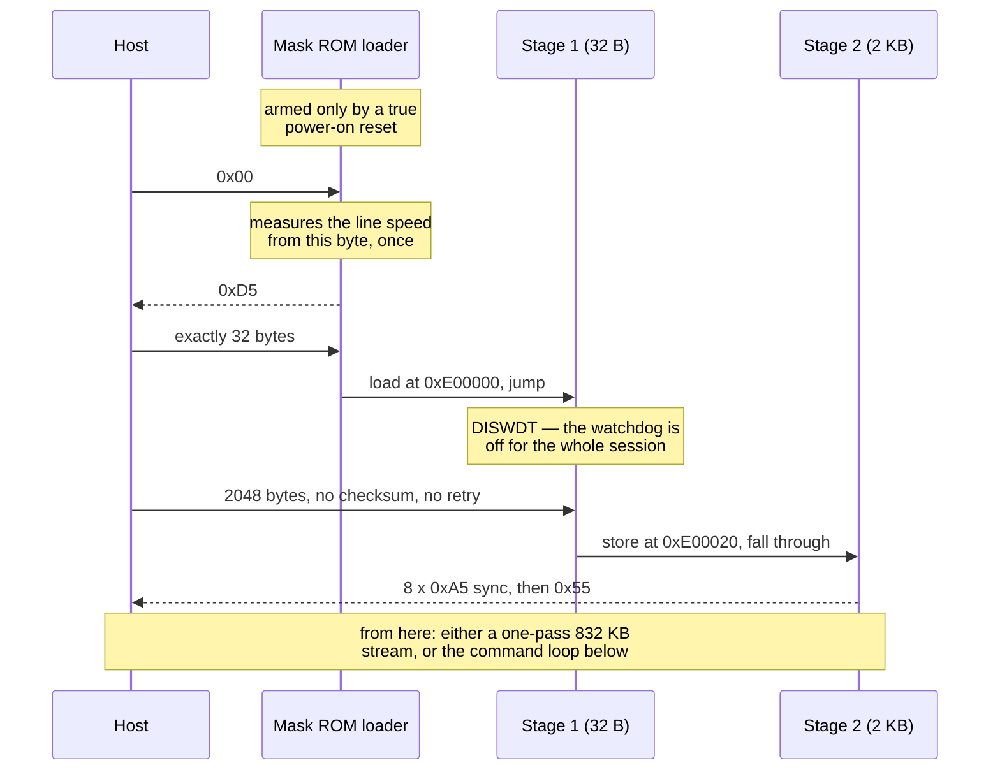

# Protocol

Bootloader entry, the two-stage handoff, the resident monitor's command set, and the
flash command sequences. Sources: Infineon's own documentation for this MCU family, plus
measurements on hardware. Every register address here has been exercised on a live unit.

---

## 1. Bootloader entry

The MCU carries a serial loader in mask ROM. It runs on a **true power-on reset** and
nothing else. An application reset, a watchdog reset or a soft reset do not bring it back —
where they go instead is the part that is inferred rather than measured, and the note below
says so.

> **Measured, because our own code used to assume otherwise.** An earlier segment-at-a-time
> reader was built on the opposite premise — stop feeding the watchdog, let the MCU reset,
> re-handshake between segments — and both could not be true. `--rearm-test` settles it: the stub streamed for
> 0.21 s and went quiet, so the watchdog reset demonstrably happened, and then **twelve
> handshakes over 3.6 s got nothing back but our own echo.** The loader did not come back.
>
> What that measures is that **the ROM loader does not come back** — not where control went
> instead. The likeliest destination is the resident CAN loader in the boot sector, which
> does not speak K-line and would leave the line exactly this silent; the application itself
> would do the same. The two have not been told apart, and nothing here depends on which it
> is. **There is no software route to a fresh BSL.** The power-cycle in front of
> every operation is a property of the silicon, not a shortcoming of the tool — and the only
> way to automate it is to switch the +12 V line itself (see `--power-line`).

```
host → 0x00
ECU  → 0xD5            (the line is half-duplex, so you see "00 d5": your own byte, then the answer)
host → EXACTLY 32 bytes
ECU  → loads them at PSRAM 0xE00000 and JMPs there
```

Two consequences that shape everything else:

* **The loader measures the line speed from that first `0x00`, once per reset.** There is
  no second attempt in the same session. Every operation therefore starts by asking for a
  power cycle. Probing repeatedly does not help — the first probe is the one that counts.
* **`0xD5` is the first byte the ECU ever transmits**, which makes it the byte most
  exposed to the line turnaround (see [QUIRKS.md](QUIRKS.md)). A near miss is accepted:
  throwing a session away over one flipped bit costs a power cycle for nothing, and the
  real proof that the stage arrived is the handshake at the end of stage 2. **That
  tolerance turns out to be documented rather than merely pragmatic** — Infineon erratum
  `BSL_X.004` describes exactly this case: in a single-wire configuration, "e.g. a K-line
  environment", the identification byte's start bit overlaps the stop bit of the host's
  zero byte, and "at 9600 Baud, the host typically interprets the identification byte as
  F5H". The prescribed workaround is that the host "should not evaluate the received
  identification byte, or should also tolerate values other than D5H".
* **And `0xD5` says nothing about which part answered.** The manual is explicit: it means
  "all devices equipped with identification registers" and "does not directly identify a
  specific derivative". ST10 parts answer it too — and accept 32 bytes — but execute them
  from `00'FA40` in IRAM rather than `0xE00000` in PSRAM. Several ECUs likely to be on the
  same bench as this one are ST10-based. Identity comes from the registers in
  [FINDINGS.md](FINDINGS.md) §2, not from the handshake.

After the jump the ROM leaves a useful environment behind:

| What | Where | Notes |
|---|---|---|
| DPP1 | `0x0081` | maps 16-bit `0x4000–0x7FFF` onto the serial peripheral |
| PSR (status) | `0x4044` | receive-ready flags in bits 13/14 |
| PSCR (status clear) | `0x4048` | |
| RBUF (receive) | `0x405C` | |
| TBUF (transmit) | `0x4080` | |
| Baud divider | `0x401E` | high word of the rate generator — see §5 |
| Flash busy | `0xFFFF06` | one bit per flash module, low nibble covers all of them |
| Flash | `0xC00000` | 832 KB, directly readable, no command needed |
| PSRAM | `0xE00000` | code loaded here; top 256 bytes are the ROM's |

---

## 2. Stage 1 — the 32-byte receiver

32 bytes is not much room for a serial receive loop that also has to survive the
watchdog. Four things make it fit:

* **`DISWDT` once.** The watchdog can still be disabled at this point (the application's
  end-of-init has not run), and it stays disabled for the whole session. No stage needs to
  feed it, which is what makes one uninterrupted 832 KB pass possible at all.
* **`DPP0 = 0x0380`** maps data addresses `0x0000–0x3FFF` onto PSRAM, so a store is a
  2-byte `MOVB [Rn]` instead of a 6-byte extended-address block.
* **The ROM's own receive loop leaves its pointers in R0/R1/R2** (status, status-clear,
  receive buffer) and they survive the jump. Free pointers buy the room for the next item.
* **Clear the receive flags after every byte.** Without it the poll never re-arms, the
  receive buffer appears to return garbage and the transfer desynchronises. This was the
  wall that made an earlier two-stage attempt look impossible.

Stage 1 receives exactly 2048 bytes into `0xE00020` and falls through into them.

The whole handoff, end to end — note that every arrow in both directions is also echoed
back to the host by the half-duplex bus, which is why so much of this protocol is about
recognising your own bytes:



The sync run at the end is the first thing the ECU transmits after receiving, so it takes
the turnaround hit that would otherwise land on a payload byte.

> The 2 KB stage is delivered by the loader with **no checksum and no retry** — 32 bytes
> leaves no room for either. Corruption usually means the monitor never starts, which the
> tool notices because no greeting arrives.
>
> A greeting is a weak test, though: plenty of single-byte changes leave a stage that starts
> and answers perfectly while behaving differently — including a change to the write gate,
> which is a two-byte immediate sitting in the middle of the blob. So the host **reads the
> whole stage back out of PSRAM at `0xE00020` and compares it byte for byte** with what it
> sent, before using it for anything. Reads are ungated and the stage's scratch lives past
> the end of its own image, so the cost is one 2 KB read — about 3.4 s at the ~610 B/s the
> stage's pacing gives at 9600. A mismatch refuses the session and names the write gate if
> it was among the differing bytes.
>
> Note what this is not: the read-back is done by the program being checked, using its own
> read loop, so it is a self-report. Corruption that touches the read path breaks the read
> instead of passing it, which is why it works — but there is no second channel here to
> make it an independent measurement.

## 3. Stage 2 — two flavours

Both are clean-room, written against the register map above.

* **`stage2dump.asm`** — streams `0xC00000–0xCCFFFF` out of the transmit buffer and then
  spins quietly. Read-only, so it cannot damage anything. One unrolled loop per 64 KB
  segment with an immediate segment override, because that addressing form was already
  proven on hardware.
* **`stage2mon.asm`** — the command monitor used for writing. Erase, program, read and
  verify happen in one session with no power cycles in between. It uses two areas of PSRAM
  past its own 2 KB slot: `0xE00900` for the 128-byte page being programmed, and
  `0xE00980` for the flash controller status it latches after every operation (§4).

Both open by transmitting a sync run, because the first byte after the line turns around
is unreliable (see [QUIRKS.md](QUIRKS.md)). The preamble absorbs that hit so no payload
byte ever does.

---

## 4. The monitor's wire protocol

```
host → A5 A5 [cmd][off_lo][off_hi][seg][cnt_lo][cnt_hi][sum16_lo][sum16_hi]
ECU  → A5 A5 [status]
```

| cmd | Meaning |
|---|---|
| 1 | PING → `0x55` |
| 2 | READ → status, then `count` bytes from `segment:offset` |
| 3 | ERASE PAGE (128 B) |
| 4 | PROGRAM one page — see below |
| 5 | ERASE SECTOR (4 KB) |
| 6 | SET BAUD — see §5 |
| 7 | CHECKSUM → status, then four bytes |

| status | Meaning |
|---|---|
| `0x4B` `K` | done |
| `0x4E` `N` | refused by the segment gate |
| `0x54` `T` | flash never went idle |
| `0x43` `C` | checksum mismatch — **nothing was executed**, resend is safe |

### Why the frame looks like this

**The marker run.** The turnaround corrupts the first byte the host sends after
receiving. The monitor discards everything until a clean `0xA5`, then skips any further
`0xA5` — a command byte is never `0xA5`, so it does not matter whether the first marker
survived.

**A 16-bit checksum, not 8.** An 8-bit sum lets a corrupted frame through once in 256.
A real write retries corrupted payloads *hundreds* of times, so "once in 256" arrives on
schedule: a whole-image write died at sector 44 with 68 bytes wrong inside one page. The
per-sector verify caught it, but a checksum that lets bad data reach flash and leans on
the verify is the wrong shape for a flasher.

**A fixed frame length, whatever the command says.** PROGRAM is two steps: the frame
first, then — only after the monitor has answered `ST_OK` — the page itself. When the
page rode along inside the frame, a command byte mangled away from `4` meant the monitor
never collected those 128 bytes, and they stayed on the wire as loose data. Loose data
contains `0xA5`, so it can be re-read as a frame, and with a weak checksum one of those
false frames eventually executes. Asking first means loose bytes never exist.

**PROGRAM payload:** `A5 A5 [128 bytes][sum16_lo][sum16_hi]`. The lead bytes here are
*counted*, not matched — page data may legitimately begin with `0xA5`.

### Safety gate

The set of flash segments that erase and program may touch is a **bitmap compiled into
the stage image**, derived by the host from the address range you actually asked for. A
read-only session compiles a mask of zero, so the code that lands refuses every erase and
program. That claim now rests on a check rather than on hope: the delivered stage is read
back out of PSRAM and compared byte for byte (§2), so the gate being the one that was
compiled is verified rather than assumed. READ is never gated — reading damages nothing, and
it is how the addressing is proven correct before the first erase.

**Know its granularity: one bit per 64 KB segment, and nothing finer.** The gate compares
the segment byte and cannot express "this segment, above this offset". A whole-image write
starts at `0xC02000`, which is inside segment `0xC0`, so its mask has bit 0 set — and the
stage would then accept an erase at `0xC00000` if the host asked for one. It never does; the
sector loop starts above the boot sector. But that means **the boot sector is protected by
the host's addressing, not by the compiled-in gate**, which is the opposite of the impression
"physically cannot erase" leaves. The host now asserts the invariant immediately before every
erase and program rather than letting it emerge from a loop bound, so it fails loudly instead
of silently — but if you want the stage itself to enforce it, that is a change to
`stage2mon.asm`, not to the host.

### Regions with no memory behind them

An erase that reports success and changes nothing means one of two things, and they need
opposite responses: a region the controller has no memory for (survivable — nothing can ever
be stored there) or an erase that genuinely failed on real flash (must stop the run). Both
leave the contents unchanged, so "the erase changed nothing" cannot separate them.

What separates them is asking the ECU what its own answer for *nothing* looks like: reading
past the end of the populated array returns whatever the flash controller says for an
address it has no memory for. On the bench unit that is `9b 1e` repeating; it is
silicon-specific, so it is read at the start of every write rather than hard-coded.

Three signals are then required before a region is treated as holding no memory:

1. the erase reported success and changed nothing,
2. the contents are a single 16-bit word repeated,
3. that word is what this ECU answers for an unmapped address.

Anything short of all three is a failing erase and stops the write at that sector. When all
three hold, the run continues — but the region is named, and the number of image bytes that
cannot be stored is printed and carried in the events. Failing every run over a region no
tool can ever write would make the failure signal worthless; saying nothing would hide part
of an image that did not land.

**And a fourth signal, from the controller itself.** The three above are inference from
symptoms; the flash controller knows the actual reason and will say so if asked. It keeps it
in two registers — `IMB_FSR_OP` at `0xFFFF08` and `IMB_FSR_PROT` at `0xFFFF0A` — but "Reset
to Read" is documented to clear exactly the interesting bits, and the monitor issues that
straight after every operation. So the stage **copies both into PSRAM at `0xE00980` before
issuing it**, and the host fetches them with an ordinary READ. No new command, no reply
anywhere changed shape, and a stage that predates this simply leaves `0xFFFF` there, which
the host reads as "no information" and carries on with what it measured.

| bit | meaning for the run |
|---|---|
| `FSR_PROT` PROER (`0x10`) | **locked** — installed write protection refused the operation. Checked *first*, so a protected sector can never be waved through as an absent one, whatever its contents look like |
| `FSR_OP` SQER (`0x10`) | the command sequence was not accepted — a protocol fault |
| `FSR_OP` OPER (`0x20`) | an earlier erase or program was cut short by a reset |
| nothing set | it was accepted and had nothing to do — the signature of an absent region |

A write also reads `PROIN` and the three `PROCON` registers once before the first erase, so
an ECU that *does* have protection installed is announced at the start instead of being
inferred from a sector that will not erase forty minutes in. `tools/probe_protection.py`
asks the same questions without writing anything.

**One address is documented, not measured:** `0xC0F000` is reserved by the device on every
part in this family (see [FINDINGS.md](FINDINGS.md) §2). The tool names it when it meets it
and *still* runs the full test — the name is a label on the measurement, not a substitute
for it.

The final read-back applies the same test **independently** rather than trusting what the
write phase concluded — an independent check that believes the thing it is checking is not
independent. This was not theoretical: for one run the write said "complete and verified"
and the final verify said "FAILED, 4096 bytes differ" about the same sector.

---

## 5. Changing speed mid-session

The ROM's speed measurement is dependable up to about 19200 and starts missing above
that. Once the monitor is running, though, the rate can be set directly by writing the
divider — and then the measurement ceiling stops mattering.

**Which register, found by measuring rather than assuming:** dump the serial peripheral's
registers after the ROM has locked onto 9600, then again after 19200, and exactly one
word moves — `+0x1E`, from 130 to 63. So

```
baud × (PDIV + 1) ≈ 1.24e6
```

**The two readings disagree, and the shipped constant is their midpoint.** 9600 × (130 + 1)
is 1 257 600; 19200 × (63 + 1) is 1 228 800. They differ by 2.3 %, which is more than the
divider quantisation can explain, so neither is simply "the" answer. The fallback compiled
in is 1 243 200 — exactly the arithmetic mean — chosen because it puts the error either side
of zero instead of all on one side. It is a fallback: see below.

**That constant is not hard-coded in practice.** Before using it the host reads the
divider back out of the ECU it is talking to and recomputes it from the rate already in
use — so the arithmetic is calibrated to *that unit's* clock. A board revision with a
different PLL setting would otherwise send every rate change to the wrong place, and the
figure above is only the fallback if the read fails.

Command 6 carries the new divider in the count field and the stage's new transmit pacing
in the offset field. It **acknowledges at the old rate and only then moves**, and the
stage rewrites its own pacing constant in RAM — without that second step the line speeds
up but the stage keeps pausing for the old rate, so reads do not get any faster, and a
pacing shorter than a byte takes on the wire would overrun the transmitter.

The acknowledgement is treated as a hint, not proof. It travels over the very link you
were unhappy enough with to be changing rates; when it goes missing the honest question
is not "did the command work" but "where is the ECU now", so the host simply asks at both
rates and believes whichever answers.

Measured, each rate exercised with a sustained 32 KB read **and** real page programming:
38400 at 2415 B/s, 57600 at 3604, 76800 at 4720, 115200 at 6973 — all byte-perfect, none
needing a resend. 153600 is the wall: after that change the ECU answers at no rate at all.
Reading and writing stop in the same place.

**Do not prove a rate with a PING.** A short exchange says nothing about a sustained
stream, and a stream says nothing about a 132-byte payload. Test with the traffic the job
uses.

**And do not trust the arithmetic alone.** The rate constant comes from the divider the ROM
picked while autobauding the host's 9600, and that divider is an integer — measured on the
same ECU minutes apart it came back 130 and then 131, moving everything derived from it by
0.8 %. At 115200 that is the difference between a byte-perfect read and a torn stream. After
setting the divider, the host sweeps a few tenths of a percent around its estimate and keeps
the rate that answers.

### Recovering the session instead of losing it

Three failure shapes, and telling them apart is what makes recovery possible. The first two
were diagnosed on the bench on 2026-07-31, after a backup was abandoned twice, each time
reporting that the monitor was gone. **It was not gone** — asked again on a drained line it
answered a PING at the same rate, with no reset. It is almost always still in the monitor,
answering, and ending a run here throws away everything done so far.

* **The monitor is stuck**, counting payload bytes that never arrived. It answers filler
  bytes with a checksum error, because the filler completes the count. Feeding `0xA5` is the
  cure, and the short payload never reaches flash.
* **The monitor is idle** and the host merely missed a status. Filler is ignored — a marker
  run is not a command — so silence *after* the line has been drained means this case, and
  the cure is to send the command again.
* **The reply does not start with `A5`.** The host is reading the middle of a stream rather
  than the front of one. Same cure: drain, ask again.

**Drain before interpreting anything.** A READ whose status was mangled leaves the ECU
streaming up to 4 KB of answer, and a host reading four bytes at a time finds payload where
it expects a status for as long as it cares to look.

> **And 57600 did not hold up on a later day.** On 2026-07-31 the same bench could not carry
> a pre-flight backup at 57600 at all: it died twice, tens of sectors in. So "57600 reads
> byte-perfect" is one session's result, not a property of the link — which is the same
> drift §4 of FINDINGS records. The tool no longer treats any measured rate as settled: a
> read that comes back short drops a rung and retries, and a write watches its own pages and
> drops a rung when they say so.

---

## 6. Flash command sequences

Confirmed two ways: against the manufacturer's documentation for this flash IP, and
against the byte sequences the ECU's own firmware uses on itself.

```
Enter page mode   [bank+0x00AA] ← 0x0050 · [target] ← 0x00AA · poll status
Load page word    64× [bank+0x00F2] ← word            (page buffer = 128 bytes)
Program page      [bank+0x00AA] ← 0x00A0 · [bank+0x005A] ← 0x00AA
Erase sector      [bank+0x00AA] ← 0x0080 · [bank+0x0054] ← 0x00AA · [target] ← 0x0033
Erase page        [bank+0x00AA] ← 0x0080 · [bank+0x0054] ← 0x00AA · [target] ← 0x0003
Clear status      [bank+0x00AA] ← 0x00F5
Reset to read     [bank+0x00AA] ← 0x00F0
```

* **`0x50` comes first.** Decompilers lose it — it is only visible in the raw bytes.
* **The upper address bits of a command cycle are don't-care, and they are what selects
  the flash module.** So every command goes into the *target's own segment*. Proven
  empirically, not assumed: a write self-test succeeded in segment `0xC7`, whose module
  base is `0xC4`.
* Status is `0xFFFF06`; wait for the low nibble to clear.
* Architecture: three 256 KB arrays at `0xC0/0xC4/0xC8` plus a 64 KB one at `0xCC`, 4 KB
  sectors, 128-byte programming. The array a command lands in is chosen by the address it
  is written to, which is what the `XX` above means.
* **Erased flash reads back as all `0x00`, not `0xFF`.** Stated in the documentation and
  confirmed on hardware. A blank check expecting `0xFF` would be wrong.
* Page erase disturbs the rest of its sector (the manual's *drain disturb* limit). Fine
  for a one-off; use sector erase for anything repeated.
* Not every address in the window is memory. See [FINDINGS.md](FINDINGS.md).

---

## 7. Building the stages

The assembled bytes are committed alongside the sources, so nothing here is needed unless
you change a stage — or unless you want to check that the committed bytes really are what
the committed source says, which for code that gets uploaded into an engine controller is
a reasonable thing to want. Either way you need a C166 assembler: **ASL**, Alfred Arnold's
macro cross assembler (GPL), handles this core with `CPU 80C167`, which covers every
instruction form used here. The executable is `asl` on Unix and `asw` on Windows, and it
builds from source on macOS, Linux and Windows:

```
curl -O http://john.ccac.rwth-aachen.de:8000/ftp/as/source/c_version/asl-current.tar.gz
tar xzf asl-current.tar.gz && cd asl-current
cp Makefile.def-samples/Makefile.def-<your-platform> Makefile.def
make                                   # produces ./asl and ./p2bin
```

Then, from the repository root:

```
python tools/build_stages.py           # assemble all eight, compare with what is shipped
python tools/sync_monitor_blob.py      # after changing stage2mon.asm
```

`build_stages.py` is a check, not a build step: it passes when every byte this project
uploads into an ECU is exactly what its `.asm` assembles to, and says so plainly when no
assembler is installed rather than failing. Eight blobs — the three stages, whose bytes
are committed beside the source, and the five bring-up diagnostics in
[HARDWARE.md](HARDWARE.md) §6, whose bytes live as literals in `klinebsl.py` and are
compared against *that*, since that is what actually gets uploaded. **MEASURED:** ASL 1.42 Bld 311, built on macOS/arm64, reproduced all
three blobs byte for byte — including ones originally assembled on Windows by a different
build. The by-hand equivalent, if you prefer it:

```
cd stages
asl -cpu 80C167 -L stage2mon.asm       # asw on Windows
p2bin stage2mon.p stage2mon.bin
cd .. && python tools/sync_monitor_blob.py
```

The last step copies the assembled bytes **and the patch offsets** into the host, and
refreshes the copy of the `.bin` that ships inside the package — the one the running tool
cross-checks its embedded bytes against. Do not transcribe those offsets by hand: they move
every time the stage changes, and a stale offset patches the middle of some other
instruction, handing the ECU a stage that does something nobody wrote.
