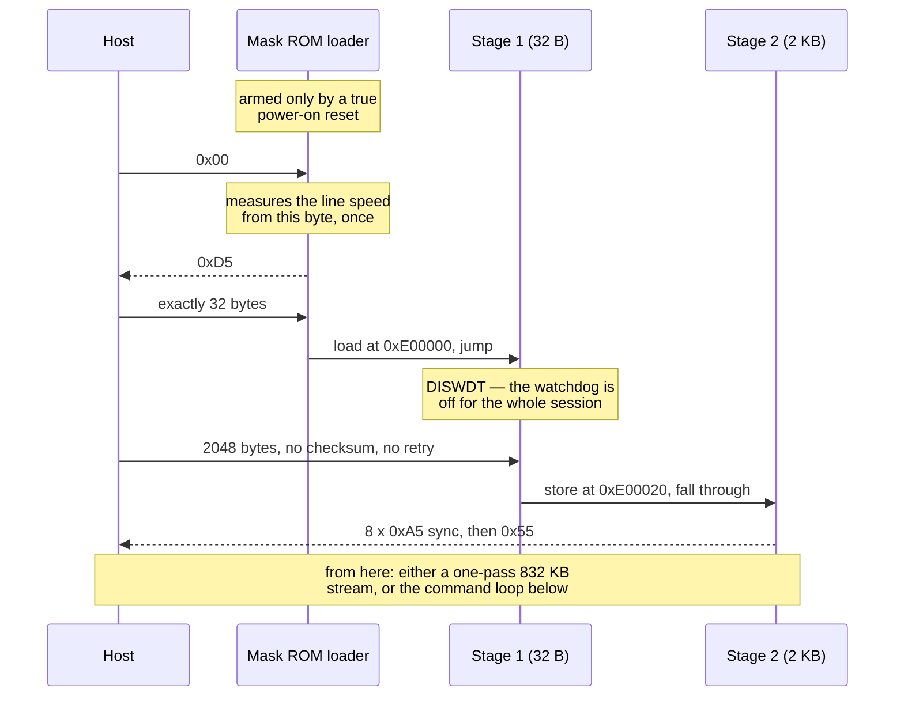

# Протокол

*[English version — PROTOCOL.md](PROTOCOL.md). Английская версия — источник истины: если
числа здесь и там разойдутся, верить надо ей, а расхождение — чинить.*

Вход в загрузчик, двухступенчатая передача управления, набор команд резидентного монитора и
последовательности команд флеша. Источники: собственная документация Infineon на это
семейство микроконтроллеров плюс измерения на железе. Каждый адрес регистра здесь опробован
на живом блоке.

---

## 1. Вход в загрузчик

В масочном ПЗУ микроконтроллера лежит последовательный загрузчик. Он запускается **только по
настоящему сбросу при включении питания** и больше ни по чему. Сброс приложения, сброс по
сторожевому таймеру и программный сброс его не возвращают — а куда управление уходит вместо
этого, является выводом, а не измерением, и врезка ниже об этом говорит.

> **Измерено, потому что наш собственный код предполагал обратное.** Более ранняя читалка,
> работавшая посегментно, была построена на противоположной посылке — перестать кормить
> сторожевой таймер, дать микроконтроллеру сброситься, заново поздороваться между
> сегментами, — и обе версии не могли быть верны одновременно. `--rearm-test` это решает:
> огрызок передавал 0.21 с и замолчал, то есть сброс по сторожевому таймеру доказуемо
> произошёл, а затем **двенадцать рукопожатий за 3.6 с не вернули ничего, кроме нашего
> собственного эха.** Загрузчик не вернулся.
>
> Измеряет это то, что **ПЗУ-загрузчик не возвращается**, а не то, куда ушло управление.
> Наиболее вероятное место — резидентный CAN-загрузчик в бут-секторе, который не говорит по
> K-line и оставил бы линию ровно такой же молчащей; само приложение вело бы себя так же. Эти
> два случая не разделены, и ничто здесь от выбора между ними не зависит. **Программного пути
> к свежему BSL не существует.** Цикл питания перед каждой операцией — свойство кремния, а не
> недостаток программы, и единственный способ его автоматизировать — коммутировать саму линию
> +12 В (см. `--power-line`).

```
host → 0x00
ECU  → 0xD5            (the line is half-duplex, so you see "00 d5": your own byte, then the answer)
host → EXACTLY 32 bytes
ECU  → loads them at PSRAM 0xE00000 and JMPs there
```

Два следствия, определяющих всё остальное:

* **Загрузчик измеряет скорость линии по этому первому `0x00`, один раз за сброс.** Второй
  попытки в той же сессии нет. Поэтому каждая операция начинается с просьбы передёрнуть
  питание. Повторные пробы не помогают — считается первая.
* **`0xD5` — первый байт, который ЭБУ вообще передаёт**, а значит он максимально подвержен
  развороту линии (см. [QUIRKS.md](QUIRKS.md)). Небольшое расхождение принимается:
  выбрасывать сессию из-за одного перевёрнутого бита — это цикл питания впустую, а настоящим
  доказательством того, что стадия доехала, служит рукопожатие в конце ступени 2. **Эта
  терпимость, как выяснилось, задокументирована, а не просто прагматична** — эрратум Infineon
  `BSL_X.004` описывает ровно этот случай: в однопроводной конфигурации, «e.g. a K-line
  environment», стартовый бит идентификационного байта перекрывается со стоповым битом
  нулевого байта хоста, и «at 9600 Baud, the host typically interprets the identification
  byte as F5H». Предписанный обходной путь — хост «should not evaluate the received
  identification byte, or should also tolerate values other than D5H».
* **И `0xD5` ничего не говорит о том, какой кристалл ответил.** Руководство прямо пишет: это
  означает «all devices equipped with identification registers» и «does not directly identify
  a specific derivative». Кристаллы ST10 отвечают так же — и принимают 32 байта, — но
  выполняют их с `00'FA40` в IRAM, а не с `0xE00000` в PSRAM. Несколько ЭБУ, которые вполне
  могут оказаться на одном столе с этим, построены на ST10. Личность берётся из регистров,
  описанных в [FINDINGS.md](FINDINGS.md) §2, а не из рукопожатия.

После перехода ПЗУ оставляет за собой полезное окружение:

| Что | Где | Примечания |
|---|---|---|
| DPP1 | `0x0081` | отображает 16-битные `0x4000–0x7FFF` на последовательный блок |
| PSR (статус) | `0x4044` | флаги готовности приёма в битах 13/14 |
| PSCR (сброс статуса) | `0x4048` | |
| RBUF (приём) | `0x405C` | |
| TBUF (передача) | `0x4080` | |
| Делитель скорости | `0x401E` | старшее слово генератора скорости — см. §5 |
| Флеш занят | `0xFFFF06` | по биту на модуль флеша, младший полубайт покрывает все |
| Флеш | `0xC00000` | 832 КБ, читается напрямую, команда не нужна |
| PSRAM | `0xE00000` | сюда грузится код; верхние 256 байт принадлежат ПЗУ |

---

## 2. Ступень 1 — 32-байтовый приёмник

32 байта — небогатое место для цикла последовательного приёма, которому вдобавок надо
пережить сторожевой таймер. Помещается это благодаря четырём вещам:

* **`DISWDT` один раз.** Сторожевой таймер на этом этапе ещё можно выключить (конец
  инициализации приложения не отработал), и он остаётся выключенным всю сессию. Ни одной
  стадии не нужно его кормить — именно это и делает возможным один непрерывный проход на
  832 КБ.
* **`DPP0 = 0x0380`** отображает адреса данных `0x0000–0x3FFF` на PSRAM, так что запись — это
  2-байтовый `MOVB [Rn]`, а не 6-байтовый блок с расширенным адресом.
* **Собственный цикл приёма ПЗУ оставляет свои указатели в R0/R1/R2** (статус, сброс статуса,
  буфер приёма), и они переживают переход. Свободные указатели дают место для следующего
  пункта.
* **Сбрасывайте флаги приёма после каждого байта.** Без этого опрос никогда не
  перевзводится, буфер приёма начинает возвращать мусор, и передача рассинхронизируется.
  Именно эта стена делала более раннюю двухступенчатую попытку выглядящей невозможной.

Ступень 1 принимает ровно 2048 байт по адресу `0xE00020` и проваливается в них.

Вся передача управления от начала до конца — учтите, что каждая стрелка в обе стороны ещё и
возвращается хосту полудуплексной шиной, и именно поэтому такая большая часть этого протокола
посвящена узнаванию собственных байт:



Синхронизирующая последовательность в конце — это первое, что ЭБУ передаёт после приёма, так
что удар разворота приходится на неё, а не на байт полезных данных.

> Стадия в 2 КБ доставляется загрузчиком **без контрольной суммы и без повторов** — в 32
> байта не помещается ни то, ни другое. Порча обычно означает, что монитор просто не
> стартует, и программа это замечает, потому что приветствие не приходит.
>
> Но приветствие — слабая проверка: множество однобайтовых изменений оставляют стадию,
> которая прекрасно стартует и отвечает, ведя себя при этом иначе, — в том числе изменение
> затвора записи, который представляет собой двухбайтовый иммедиат в середине блоба. Поэтому
> хост **вычитывает всю стадию обратно из PSRAM по адресу `0xE00020` и сравнивает её байт в
> байт** с тем, что отправил, прежде чем что-либо на ней делать. Чтения не затворены, а
> собственные рабочие ячейки стадии лежат за концом её образа, так что цена — одно чтение
> 2 КБ, примерно 3.4 с при тех ~610 Б/с, которые даёт её собственная пауза передачи на 9600.
> Несовпадение отменяет сессию и называет затвор записи, если он оказался среди разошедшихся
> байт.
>
> Учтите, чем это не является: вычитывание выполняет та самая программа, которую проверяют, её
> же циклом чтения, то есть это самоотчёт. Порча, затронувшая путь чтения, ломает чтение, а не
> проходит его, — потому это и работает; но второго канала, который сделал бы проверку
> независимым измерением, здесь нет.

## 3. Ступень 2 — две разновидности

Обе написаны с нуля, по карте регистров выше.

* **`stage2dump.asm`** — выдаёт `0xC00000–0xCCFFFF` через буфер передачи, а затем тихо
  крутится. Только чтение, поэтому повредить ничего не может. По одному развёрнутому циклу на
  каждый 64-килобайтный сегмент с непосредственным переопределением сегмента, потому что
  именно эта форма адресации уже была доказана на железе.
* **`stage2mon.asm`** — командный монитор, используемый для записи. Стирание,
  программирование, чтение и сверка происходят в одной сессии без циклов питания между ними.
  Он использует две области PSRAM за пределами собственного слота в 2 КБ:
  `0xE00900` под программируемую 128-байтовую страницу и `0xE00980` под статус контроллера
  флеша, который он защёлкивает после каждой операции (§4).

Обе начинают с передачи синхронизирующей последовательности, потому что первый байт после
разворота линии ненадёжен (см. [QUIRKS.md](QUIRKS.md)). Преамбула принимает этот удар на себя,
чтобы его никогда не принимал байт полезных данных.

---

## 4. Проводной протокол монитора

```
host → A5 A5 [cmd][off_lo][off_hi][seg][cnt_lo][cnt_hi][sum16_lo][sum16_hi]
ECU  → A5 A5 [status]
```

| cmd | Значение |
|---|---|
| 1 | PING → `0x55` |
| 2 | READ → статус, затем `count` байт с `segment:offset` |
| 3 | ERASE PAGE (128 Б) |
| 4 | PROGRAM одна страница — см. ниже |
| 5 | ERASE SECTOR (4 КБ) |
| 6 | SET BAUD — см. §5 |
| 7 | CHECKSUM → статус, затем четыре байта |

| статус | Значение |
|---|---|
| `0x4B` `K` | сделано |
| `0x4E` `N` | отвергнуто затвором сегментов |
| `0x54` `T` | флеш так и не освободился |
| `0x43` `C` | контрольная сумма не сошлась — **ничего не выполнялось**, пересылать безопасно |

### Почему кадр выглядит именно так

**Маркерная последовательность.** Разворот портит первый байт, который хост отправляет после
приёма. Монитор отбрасывает всё до чистого `0xA5`, а затем пропускает все последующие `0xA5`
— командный байт никогда не равен `0xA5`, так что неважно, уцелел ли первый маркер.

**16-битная контрольная сумма, а не 8.** 8-битная сумма пропускает испорченный кадр раз
на 256. Настоящая запись повторяет испорченные посылки *сотни* раз, так что «раз на 256»
приходит точно по расписанию: запись целого образа умерла на секторе 44 с 68 неверными
байтами внутри одной страницы. Посекторная сверка это поймала, но контрольная сумма,
пропускающая плохие данные во флеш и опирающаяся на сверку, — неправильная форма для флешера.

**Фиксированная длина кадра, что бы ни говорила команда.** PROGRAM состоит из двух шагов:
сначала кадр, и только после того, как монитор ответил `ST_OK`, — сама страница. Когда
страница ехала внутри кадра, командный байт, искажённый прочь от `4`, означал, что монитор
эти 128 байт не соберёт, и они оставались на проводе как бесхозные данные. Бесхозные данные
содержат `0xA5`, значит их можно перечитать как кадр, а при слабой контрольной сумме один из
таких ложных кадров рано или поздно выполнится. Спросить сначала — значит бесхозных байт не
бывает вовсе.

**Посылка PROGRAM:** `A5 A5 [128 bytes][sum16_lo][sum16_hi]`. Ведущие байты здесь
*отсчитываются*, а не сопоставляются: данные страницы вполне законно могут начинаться с
`0xA5`.

### Затвор безопасности

Набор сегментов флеша, которые стирание и программирование вправе трогать, — это **битовая
маска, вкомпилированная в образ стадии** и выведенная хостом из того диапазона адресов,
который вы действительно запросили. Сессия только на чтение компилирует нулевую маску, так
что приземлившийся код отвергает любое стирание и программирование. Теперь это утверждение
опирается на проверку, а не на надежду: доставленная стадия вычитывается обратно из PSRAM и
сравнивается байт в байт (§2), так что затвор, оказавшийся в ЭБУ, именно проверен, а не
предположен. READ не затворяется никогда — чтение ничего не портит, и именно им правильность
адресации доказывается до первого стирания.

**Знайте его гранулярность: один бит на 64-килобайтный сегмент, и ничего мельче.** Затвор
сравнивает байт сегмента и не умеет выразить «этот сегмент, выше этого смещения». Запись
целого образа начинается с `0xC02000`, что лежит внутри сегмента `0xC0`, поэтому её маска
имеет установленный бит 0 — и стадия приняла бы стирание по `0xC00000`, если бы хост его
попросил. Он никогда не просит: цикл по секторам начинается выше бут-сектора. Но это значит,
что **бут-сектор защищён адресацией хоста, а не вкомпилированным затвором**, что прямо
противоположно впечатлению, которое оставляет фраза «физически не может стереть». Теперь хост
утверждает этот инвариант непосредственно перед каждым стиранием и программированием, а не
оставляет его следствием границы цикла, — так что отказ громкий, а не тихий; но если вы
хотите, чтобы это обеспечивала сама стадия, менять надо `stage2mon.asm`, а не хост.

### Области, за которыми нет памяти

Стирание, сообщившее об успехе и ничего не изменившее, означает одно из двух, и реакции нужны
противоположные: либо область, под которую у контроллера нет памяти (переживаемо — там ничего
и никогда нельзя сохранить), либо стирание, которое по-настоящему отказало на настоящем флеше
(должно остановить прогон). Оба случая оставляют содержимое неизменным, так что «стирание
ничего не изменило» их не разделяет.

Разделяет их вопрос к самому ЭБУ, как выглядит его собственный ответ на *ничто*: чтение за
концом заполненного массива возвращает то, что контроллер флеша говорит про адрес, под
который у него нет памяти. На стендовом экземпляре это `9b 1e` по кругу; значение зависит от
кремния, поэтому оно читается в начале каждой записи, а не забито в код.

Прежде чем считать область не имеющей памяти, требуются три признака:

1. стирание сообщило об успехе и ничего не изменило,
2. содержимое представляет собой одно 16-битное слово, повторённое,
3. это слово совпадает с тем, что данный ЭБУ отвечает для неотображённого адреса.

Всё, что меньше трёх сразу, — это отказавшее стирание, и запись останавливается на этом
секторе. Когда все три сходятся, прогон продолжается, но область называется, а число байт
образа, которые не удастся сохранить, печатается и попадает в события. Проваливать каждый
прогон на области, которую ни один инструмент никогда не запишет, обесценило бы сам сигнал
отказа; а промолчать значило бы скрыть часть образа, которая не легла.

**И четвёртый признак — от самого контроллера.** Три предыдущих являются выводом из
симптомов; контроллер флеша знает настоящую причину и назовёт её, если спросить. Он хранит её
в двух регистрах — `IMB_FSR_OP` по `0xFFFF08` и `IMB_FSR_PROT` по `0xFFFF0A`, — но «Reset to
Read» документированно очищает ровно интересные биты, а монитор выдаёт эту команду сразу
после каждой операции. Поэтому стадия **копирует оба в PSRAM по `0xE00980` до того, как её
выдать**, а хост забирает их обычным READ. Ни новой команды, ни изменения формы хоть какого-то
ответа; а стадия, которая старше этого механизма, просто оставит там `0xFFFF`, что хост
прочтёт как «сведений нет» и продолжит с тем, что измерил.

| бит | что это значит для прогона |
|---|---|
| `FSR_PROT` PROER (`0x10`) | **заблокировано** — установленная защита записи отвергла операцию. Проверяется *первым*, чтобы защищённый сектор нельзя было пропустить как отсутствующий, как бы ни выглядело его содержимое |
| `FSR_OP` SQER (`0x10`) | последовательность команд не принята — ошибка протокола |
| `FSR_OP` OPER (`0x20`) | предыдущее стирание или программирование было прервано сбросом |
| ничего не установлено | команда принята и делать было нечего — подпись отсутствующей области |

Запись вдобавок один раз читает `PROIN` и три регистра `PROCON` перед первым стиранием, так
что ЭБУ, у которого защита *действительно* установлена, объявляется в начале, а не выводится
из сектора, который не стирается на сороковой минуте. `tools/probe_protection.py` задаёт те же
вопросы, ничего не записывая.

**Один адрес задокументирован, а не измерен:** `0xC0F000` зарезервирован устройством на всех
кристаллах этого семейства (см. [FINDINGS.md](FINDINGS.md) §2). Программа называет его, когда
встречает, и *всё равно* проводит полную проверку — имя является ярлыком на измерении, а не
его заменой.

Итоговое вычитывание применяет тот же тест **независимо**, а не доверяет выводам этапа записи:
независимая проверка, которая верит проверяемому, независимой не является. И это не
умозрительно: в одном прогоне запись сказала «завершено и проверено», а итоговая сверка —
«ОТКАЗ, 4096 байт различаются» про тот же самый сектор.

---

## 5. Смена скорости по ходу сессии

Измерение скорости в ПЗУ надёжно примерно до 19200 и выше начинает промахиваться. Но когда
монитор уже работает, скорость можно задать напрямую, записав делитель, — и потолок измерения
перестаёт иметь значение.

**Какой регистр — найдено измерением, а не предположением:** снимите регистры
последовательного блока после того, как ПЗУ захватило 9600, потом снова после 19200, и ровно
одно слово сдвигается — `+0x1E`, со 130 на 63. Значит

```
baud × (PDIV + 1) ≈ 1.24e6
```

**Два отсчёта не согласуются, и вкомпилированная константа — их середина.** 9600 × (130 + 1)
даёт 1 257 600; 19200 × (63 + 1) даёт 1 228 800. Они различаются на 2.3 %, что больше, чем
объясняется квантованием делителя, так что ни один из них не является просто «тем самым»
ответом. Запасное значение в коде — 1 243 200, ровно среднее арифметическое, выбранное потому,
что оно кладёт ошибку по обе стороны от нуля, а не всю на одну. Это именно запасное значение:
см. ниже.

**На практике эта константа не забита жёстко.** Прежде чем ею пользоваться, хост вычитывает
делитель из того ЭБУ, с которым разговаривает, и пересчитывает её из уже используемой
скорости, так что арифметика откалибрована под тактовую *этого* экземпляра. Иначе ревизия
платы с другой настройкой ФАПЧ отправляла бы каждую смену скорости не туда, а приведённая
цифра — лишь запасной вариант на случай, если чтение не удалось.

Команда 6 несёт новый делитель в поле счёта, а новую паузу передачи для стадии — в поле
смещения. Она **подтверждает на старой скорости и только потом переходит**, а стадия
переписывает собственную константу паузы в ОЗУ: без этого второго шага линия ускоряется, но
стадия продолжает выдерживать паузу под старую скорость, так что чтение быстрее не
становится, а пауза короче времени байта на проводе привела бы к переполнению передатчика.

Подтверждение считается подсказкой, а не доказательством. Оно идёт по той самой связи,
которой вы были достаточно недовольны, чтобы менять скорость; когда оно пропадает, честный
вопрос звучит не «сработала ли команда», а «где сейчас ЭБУ», — поэтому хост просто спрашивает
на обеих скоростях и верит той, что ответила.

Измерено, каждая скорость прогнана с непрерывным чтением 32 КБ **и** настоящим
программированием страниц: 38400 на 2415 Б/с, 57600 на 3604, 76800 на 4720, 115200 на 6973 —
все байт в байт, ни одной пересылки. 153600 — это стена: после такой смены ЭБУ не отвечает
уже ни на какой скорости. Чтение и запись упираются в одно и то же место.

**Не доказывайте скорость пингом.** Короткий обмен ничего не говорит о непрерывном потоке, а
поток ничего не говорит о 132-байтовой посылке. Проверяйте тем трафиком, которым работаете.

**И не доверяйте одной арифметике.** Константа скорости берётся из делителя, который ПЗУ
выбрало, подстраиваясь под наши 9600, и этот делитель целый: измеренный на одном и том же ЭБУ
с разницей в минуты, он вернулся 130, а потом 131, что сдвигает всё производное от него на
0.8 %. На 115200 это разница между чтением байт в байт и разорванным потоком. Установив
делитель, хост проходится на несколько десятых процента вокруг своей оценки и оставляет ту
скорость, что ответила.

### Как спасти сессию вместо того, чтобы её потерять

Три формы отказа, и умение их различать — это и есть то, что делает восстановление возможным.
Первые две продиагностированы на стенде 2026-07-31, после того как бэкап был дважды брошен,
и оба раза сообщалось, что монитор пропал. **Он не пропадал** — спрошенный заново на слитой
линии, он ответил на PING на той же скорости, без всякого сброса. Он почти всегда всё ещё в
мониторе и отвечает, а завершение прогона здесь выбрасывает всё сделанное.

* **Монитор застрял**, считая байты посылки, которые не пришли. На байты-заполнители он
  отвечает ошибкой контрольной суммы, потому что заполнитель досчитывает счёт. Лечится
  подачей `0xA5`, и короткая посылка при этом никогда не попадает во флеш.
* **Монитор простаивает**, а хост просто пропустил статус. Заполнитель игнорируется —
  маркерная последовательность не является командой, — так что тишина *после* того, как линия
  слита, означает именно этот случай, и лечится повторной отправкой команды.
* **Ответ не начинается с `A5`.** Хост читает середину потока, а не его начало. Лечение то
  же: слить и спросить снова.

**Сливайте, прежде чем что-либо интерпретировать.** READ, чей статус был искажён, оставляет
ЭБУ передающим до 4 КБ ответа, и хост, читающий по четыре байта, будет находить полезные
данные там, где ждёт статус, ровно столько, сколько захочет искать.

> **А 57600 не выдержала в другой день.** 2026-07-31 тот же стенд вообще не смог снять
> предзаписной бэкап на 57600: он умер дважды, через десятки секторов. То есть «57600 читает
> байт в байт» — результат одной сессии, а не свойство связи; это тот же дрейф, который
> фиксирует §4 в FINDINGS. Программа больше не считает ни одну измеренную скорость
> окончательной: чтение, вернувшееся коротким, спускается на ступень и повторяет, а запись
> следит за собственными страницами и спускается, когда они об этом говорят.

---

## 6. Последовательности команд флеша

Подтверждены двумя способами: по документации производителя на этот блок флеша и по тем
последовательностям байт, которые собственная прошивка ЭБУ применяет к себе самой.

```
Enter page mode   [bank+0x00AA] ← 0x0050 · [target] ← 0x00AA · poll status
Load page word    64× [bank+0x00F2] ← word            (page buffer = 128 bytes)
Program page      [bank+0x00AA] ← 0x00A0 · [bank+0x005A] ← 0x00AA
Erase sector      [bank+0x00AA] ← 0x0080 · [bank+0x0054] ← 0x00AA · [target] ← 0x0033
Erase page        [bank+0x00AA] ← 0x0080 · [bank+0x0054] ← 0x00AA · [target] ← 0x0003
Clear status      [bank+0x00AA] ← 0x00F5
Reset to read     [bank+0x00AA] ← 0x00F0
```

* **`0x50` идёт первым.** Декомпиляторы его теряют — он виден только в сырых байтах.
* **Старшие биты адреса в командном цикле безразличны, и именно они выбирают модуль флеша.**
  Поэтому каждая команда идёт в *собственный сегмент цели*. Доказано опытом, а не
  предположено: самотест записи прошёл в сегменте `0xC7`, чья база модуля — `0xC4`.
* Статус — `0xFFFF06`; ждите очистки младшего полубайта.
* Устройство: три массива по 256 КБ по `0xC0/0xC4/0xC8` плюс один на 64 КБ по `0xCC`, сектора
  по 4 КБ, программирование по 128 байт. Массив, в который попадает команда, выбирается
  адресом, по которому она записана, — это и означает `XX` выше.
* **Стёртый флеш читается как сплошные `0x00`, а не `0xFF`.** Заявлено в документации и
  подтверждено на железе. Проверка на чистоту, ожидающая `0xFF`, была бы неверна.
* Стирание страницы возмущает остальную часть её сектора (предел *drain disturb* из
  руководства). Для разового случая нормально; для чего-то повторяющегося пользуйтесь
  стиранием сектора.
* Не всякий адрес в окне является памятью. См. [FINDINGS.md](FINDINGS.md).

---

## 7. Сборка стадий

Собранные байты лежат в репозитории рядом с исходниками, так что ничего из этого не нужно,
пока вы не меняете стадию — или пока вам не захочется проверить, что закоммиченные байты
действительно являются тем, что говорит закоммиченный исходник, а для кода, который
загружается в блок управления двигателем, это разумное желание. В любом случае нужен
ассемблер C166: **ASL**, макро-кросс-ассемблер Альфреда Арнольда (GPL), понимает это ядро с
`CPU 80C167`, и этого хватает на все использованные здесь формы команд. Исполняемый файл
называется `asl` на Unix и `asw` на Windows, и он собирается из исходников на macOS, Linux и
Windows:

```
curl -O http://john.ccac.rwth-aachen.de:8000/ftp/as/source/c_version/asl-current.tar.gz
tar xzf asl-current.tar.gz && cd asl-current
cp Makefile.def-samples/Makefile.def-<your-platform> Makefile.def
make                                   # produces ./asl and ./p2bin
```

Затем, из корня репозитория:

```
python tools/build_stages.py           # assemble all eight, compare with what is shipped
python tools/sync_monitor_blob.py      # after changing stage2mon.asm
```

`build_stages.py` — это проверка, а не шаг сборки: она проходит, когда каждый байт, который
этот проект загружает в ЭБУ, в точности совпадает с тем, во что ассемблируется его `.asm`, и
внятно сообщает, когда ассемблер не установлен, вместо того чтобы падать. Восемь блобов — три
стадии, чьи байты закоммичены рядом с исходником, и пять диагностик для подъёма стенда из
[HARDWARE.md](HARDWARE.md) §6, чьи байты живут литералами в `klinebsl.py` и сравниваются
именно *с ними*, поскольку именно они и загружаются. **ИЗМЕРЕНО:** ASL 1.42 Bld 311, собранный
на macOS/arm64, воспроизвёл все три блоба байт в байт — включая те, что изначально
ассемблировались на Windows другой сборкой. Ручной эквивалент, если он вам милее:

```
cd stages
asl -cpu 80C167 -L stage2mon.asm       # asw on Windows
p2bin stage2mon.p stage2mon.bin
cd .. && python tools/sync_monitor_blob.py
```

Последний шаг копирует в хост собранные байты **и смещения патчей**, а также обновляет ту
копию `.bin`, которая едет внутри пакета, — ту самую, с которой работающая программа сверяет
свои встроенные байты. Не переписывайте эти смещения руками: они двигаются при каждом
изменении стадии, а устаревшее смещение патчит середину какой-нибудь другой инструкции, выдавая
ЭБУ стадию, которая делает то, чего никто не писал.
